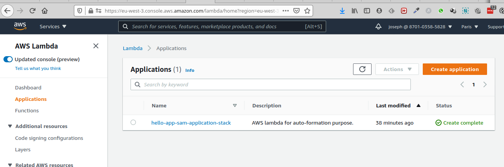
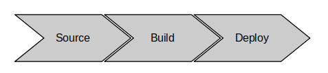
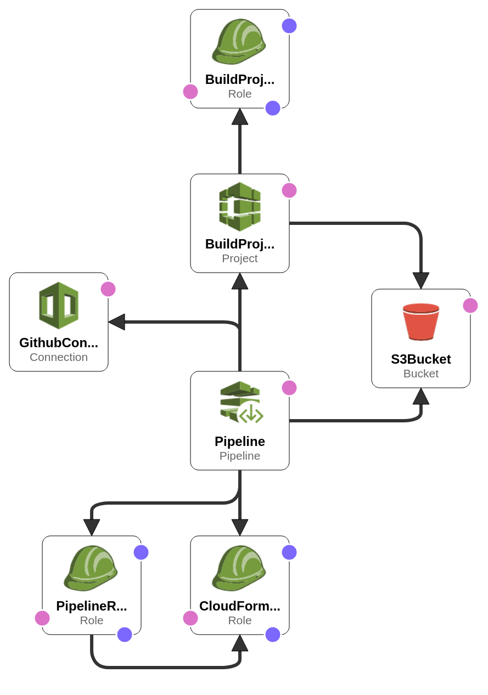
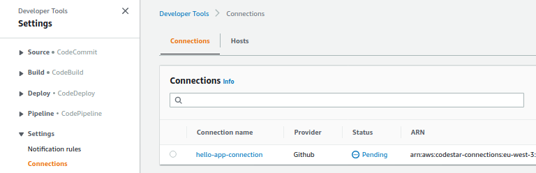
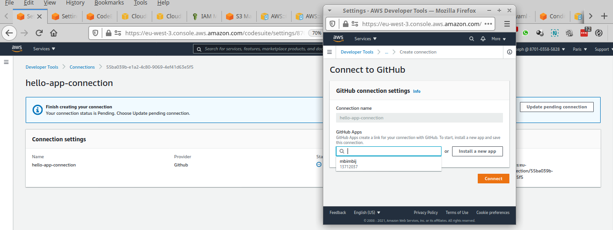
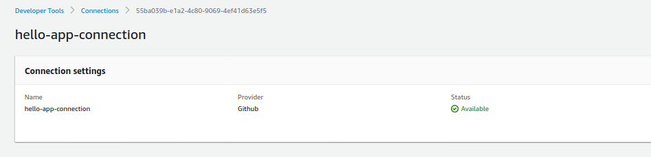
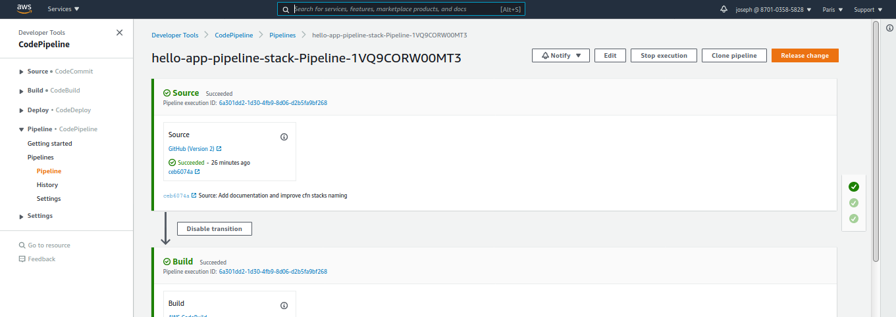
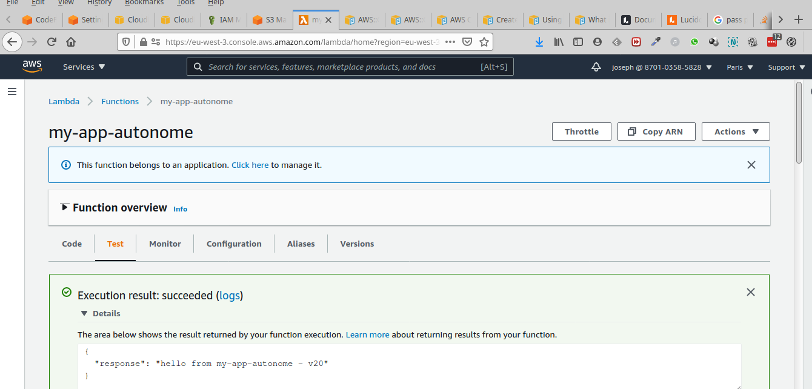

# Serverless CI/CD with safedeployments, as code.

:fr: Sommaire / :gb: Table of Contents
=================

<!--ts-->

- [:fr: Description du projet](#fr-description-du-projet)
  + [Introduction générale](#introduction-gnrale)
  + [Présentation de la pipeline](#prsentation-de-la-pipeline)
  * [Organisation du project](#organisation-du-project)
  * [Lancement et éxécution du projet](#lancement-et-xcution-du-projet)
    + [Pré-requis](#pr-requis)
    + [Création et éxécution de la pipeline](#cration-et-xcution-de-la-pipeline)
  * [Prochaines étapes](#prochaines-tapes)
  * [Liens](#liens)
- [:gb: Project Description](#gb-project-description)

<small><i><a href='http://ecotrust-canada.github.io/markdown-toc/'>Table of contents generated with markdown-toc</a></i></small>

---

# :fr: Description du projet

## Présentation

### Introduction générale

Le but de ce projet est d'implémenter une pipeline CI/CD pour une application Serverless.

L'application est une simple fonction lambda, renvoyant "hello from my-app-autonome - vXX", où l'on fait varier "XX" 
pour vérifier que la pipeline est en mesure déployer une nouvelle version à jour.

La source d'inspiration est le code généré par AWS lorsque l'on crée une "Application Lambda", qui va créer toute une pipeline de CI/CD 
en plus du code de la fonction lambda.

Le lien vers le code est donné dans la section [Liens](#liens).

### Présentation de la pipeline

Puisqu'il s'agit de ma première tentative d'implémentation, la pipeline est très simple: 

- "Source" récupère le projet depuis Github
- "Build" lance `sam package` et place de template résultant dans S3
- "Deploy" déploie la fonction lambda (en mode "canary"), à partir de la sortie de l'étape "Build"

Le code de la pipeline se trouve dans un template cloudformation: `infra-stack/infra-stack.yml`. 
Voici les ressources déployées par le template:

on a donc: 

- un projet `CodePipeline` pour l'orchestration de la pipeline, avec un rôle associé 
- un bucket `S3` qui va servir à transmettre la sortie d'une étape en entrée de l'étape suivante
- pour l'étape "Source": 
  - une connection `Github`
- pour l'étape "Build":
  - un projet `CodeBuild` et un rôle `IAM` associé, permettant de:
    - écrire des logs dans `CloudWatch`
    - pousser le résultat du build dans `S3`
- pour l'étape "Deploy":
  - un stage de `CodePipeline`, qui va récupérer le template SAM processé par  `CodeBuild`, et configuré pour créer / mettre un jour une stack `CloudFormation` associée à ce template SAM. 
  - un rôle `IAM` que `CodePipeline` va passer à la stack `CloudFormation`/`SAM`. C'est cette stack qui va déployer la fonction `Lambda`   

## Organisation du project

- Le répertoire `infra-stack` contient le template `CloudFormation` de la pipeline
- Le fichier `sam-template.yml` contient ... le template SAM
- Le module maven `main-function` contient 
  - le code java de la fonction `Lambda`
  - un test d'intégration, invoquant la lambda avant de procéder au déploiement (déplacement progressif d'un alias)
- Le module maven `integration-tests` contient du code permettant de wrapper l'éxécution du test d'intégration dans un fonction `Lambda`, car `SAM` n'accepte que des fonctions `Lambda` en pre et post traffic hook. 
  - oui c'est de l'archi héxa appliqué à l'éxécution de tests :) 

##  Lancement et éxécution du projet

### Pré-requis

Installez la CLI AWS et éxécutez "aws configure".
[https://docs.aws.amazon.com/cli/latest/userguide/install-cliv2.html](https://docs.aws.amazon.com/cli/latest/userguide/install-cliv2.html) 
et sélectionnez la version de la documentation adaptée à votre cas.

### Création et éxécution de la pipeline

1. éxécuter la commande: `aws cloudformation create-stack --stack-name hello-app-pipeline-stack --template-body file://infra-stack/infra-stack.yml --parameters ParameterKey=ApplicationName,ParameterValue=hello-app --capabilities CAPABILITY_NAMED_IAM`
2. activer la connection github une fois que celle-ci est créé

cliquer sur `update pending connections` et sélectionner la `github app` correspondante.

Pour plus d'informations sur la création d'une connection github et d'une `github app`, visitez le lien suivant:
[https://docs.aws.amazon.com/dtconsole/latest/userguide/connections-create-github.html#connections-create-github-console](https://docs.aws.amazon.com/dtconsole/latest/userguide/connections-create-github.html#connections-create-github-console)

fermez la popup, rechargez la page, et la connexion devrait avoir un status `Available`.

Vous aurez p-e besoin de relancer la pipeline si elle s'est lancé avant que vous ayez effectué l'activation de la connexion github.

3. Après la fin de la création de la pipeline, et l'éxécution d'un premier déploiement, vous devriez avoir un déploiement vert, sans erreur : 

4. La fonction lambda devrait être déployée, et une invocation de test devrait s'effectuer sans erreur:

5. Si vous avez configuré la stack de la pipeline pour utliser votre repo github (paramètre `GithubRepo` de `infra-stack/infra-stack.yml`), 
   mettez à jour le code, poussez-le et vérifiez la réponse dans l'éxécution de test de la Lambda 
   (même si cette vérification est faite automatiquement par le Pre-Hook de déploiement, c'est bien de s'en convaincre en le faisant manuellment) 

## Prochaines étapes

1. Ajouter et tester des alarmes et du rollback en cas d'erreur
2. Rendre rendre les policies IAM moins ouvertes. 
3. Déploiement "cross-account". On pourra pour cela s'appuyer sur 

## Liens

- https://github.com/aws/serverless-application-model/blob/master/docs/safe_lambda_deployments.rst
- https://docs.aws.amazon.com/serverless-application-model/latest/developerguide/automating-updates-to-serverless-apps.html
- https://github.com/aws-samples/aws-lambda-sample-applications/blob/master/CICD-toolchain-for-serverless-applications/toolchain.yml

# :gb: Project Description

Coming soon