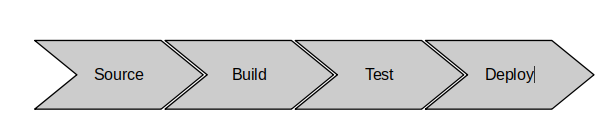

# Serverless CI/CD with safedeployments, as code.

:fr: Sommaire / :gb: Table of Contents
=================

<!--ts-->

- [:fr: Description du projet](#fr-description-du-projet)
  * [Présentation](#prsentation)
    + [Introduction générale](#introduction-gnrale)
    + [Présentation de la pipeline](#prsentation-de-la-pipeline)
    * [Organisation du project](#organisation-du-project)
  * [Lancement et éxécution du projet](#lancement-et-xcution-du-projet)
  * [Prochaines étapes](#prochaines-tapes)
  * [Liens](#liens)
- [:gb: Project Description](#gb-project-description)
  - [Presentation](#presentation)
    * [Overview](#overview)
    * [Presentation of the pipeline](#presentation-of-the-pipeline)
    * [Organisation of the project](#organisation-of-the-project)
  - [Launching and executing the project](#launching-and-executing-the-project)
  - [Next steps](#next-steps)
  - [Links](#links)

<small><i><a href='http://ecotrust-canada.github.io/markdown-toc/'>Table of contents generated with markdown-toc</a></i></small>

---

# :fr: Description du projet

## Présentation

### Introduction générale

Le but de ce projet est d'implémenter une pipeline CI/CD pour une application Serverless.

L'application est une simple fonction lambda, renvoyant "hello from my-app-autonome - vXX", où l'on fait varier "XX" 
pour vérifier que la pipeline est en mesure déployer une nouvelle version à jour.

La source d'inspiration est le code généré par AWS lorsque l'on crée une "Application Lambda", qui va créer toute une pipeline de CI/CD 
en plus du code de la fonction lambda.

Le code du template cloudformation ayant servi d'inspiration est disponible ici: [https://github.com/aws-samples/aws-lambda-sample-applications/tree/master/CICD-toolchain-for-serverless-applications](https://github.com/aws-samples/aws-lambda-sample-applications/tree/master/CICD-toolchain-for-serverless-applications).

Le lien est aussi donné dans la section [Liens](#liens).

### Présentation de la pipeline

Puisqu'il s'agit de ma première tentative d'implémentation, la pipeline est très simple: 

- "Source" récupère le projet depuis Github
- "Build" lance `sam package` et place de template résultant dans S3
- "Test" invoque la lambda déployée, juste avant de diriger du traffic vers la nouvelle version
- "Deploy" déploie la fonction lambda (en mode "canary"), à partir de la sortie de l'étape "Build"

Le code de la pipeline se trouve dans un template cloudformation: `infra-stack/infra-stack.yml`. 
Voici les ressources déployées par le template:

on a donc: 

- un projet `CodePipeline` pour l'orchestration de la pipeline, avec un rôle associé 
- un bucket `S3` qui va servir à transmettre la sortie d'une étape en entrée de l'étape suivante
- pour l'étape "Source": 
  - une connection `Github`
- pour l'étape "Build":
  - un projet `CodeBuild` et un rôle `IAM` associé, permettant de:
    - écrire des logs dans `CloudWatch`
    - pousser le résultat du build dans `S3`
- pour l'étape "Test":
  - un hook pre-traffic dans le template SAM de la fonction `Lambda`, qui va éxécuter un "test d'intégration" avant que du traffic soit redirigé vers la nouvelle version de la `Lambda` 
- pour l'étape "Deploy":
  - un stage de `CodePipeline`, qui va récupérer le template SAM processé par  `CodeBuild`, et configuré pour créer / mettre un jour une stack `CloudFormation` associée à ce template SAM. 
  - un rôle `IAM` que `CodePipeline` va passer à la stack `CloudFormation`/`SAM`. C'est cette stack qui va déployer la fonction `Lambda`   

### Organisation du project

- Le répertoire `infra-stack` contient le template `CloudFormation` de la pipeline
- Le fichier `sam-template.yml` contient ... le template SAM
- Le module maven `main-function` contient 
  - le code java de la fonction `Lambda`
  - un test d'intégration, invoquant la lambda avant de procéder au déploiement (déplacement progressif d'un alias)
- Le module maven `integration-tests` contient du code permettant de wrapper l'éxécution du test d'intégration dans un fonction `Lambda`, car `SAM` n'accepte que des fonctions `Lambda` en pre et post traffic hook. 
  - oui c'est de l'archi héxa appliqué à l'éxécution de tests :) 

##  Lancement et éxécution du projet

### Pré-requis

Installez la CLI AWS et éxécutez "aws configure".
[https://docs.aws.amazon.com/cli/latest/userguide/install-cliv2.html](https://docs.aws.amazon.com/cli/latest/userguide/install-cliv2.html) 
et sélectionnez la version de la documentation adaptée à votre cas.

### Création et éxécution de la pipeline

1. éxécuter la commande: `aws cloudformation create-stack --stack-name hello-app-pipeline-stack --template-body file://infra-stack/infra-stack.yml --parameters ParameterKey=ApplicationName,ParameterValue=hello-app --capabilities CAPABILITY_NAMED_IAM`
2. activer la connection github une fois que celle-ci est créé

cliquer sur `update pending connections` et sélectionner la `github app` correspondante.

Pour plus d'informations sur la création d'une connection github et d'une `github app`, visitez le lien suivant:
[https://docs.aws.amazon.com/dtconsole/latest/userguide/connections-create-github.html#connections-create-github-console](https://docs.aws.amazon.com/dtconsole/latest/userguide/connections-create-github.html#connections-create-github-console)

fermez la popup, rechargez la page, et la connexion devrait avoir un status `Available`.

Vous aurez p-e besoin de relancer la pipeline si elle s'est lancé avant que vous ayez effectué l'activation de la connexion github.

3. Après la fin de la création de la pipeline, et l'éxécution d'un premier déploiement, vous devriez avoir un déploiement vert, sans erreur : 

4. La fonction lambda devrait être déployée, et une invocation de test devrait s'effectuer sans erreur:

5. Si vous avez configuré la stack de la pipeline pour utliser votre repo github (paramètre `GithubRepo` de `infra-stack/infra-stack.yml`), 
   mettez à jour le code, poussez-le et vérifiez la réponse dans l'éxécution de test de la Lambda 
   (même si cette vérification est faite automatiquement par le Pre-Hook de déploiement, c'est bien de s'en convaincre en le faisant manuellment) 

## Prochaines étapes

1. Ajouter et tester des alarmes et du rollback en cas d'erreur
2. Rendre rendre les policies IAM moins ouvertes. 
3. Déploiement "cross-account". On pourra pour cela s'appuyer sur [https://github.com/awslabs/aws-refarch-cross-account-pipeline](https://github.com/awslabs/aws-refarch-cross-account-pipeline)

## Liens

- [https://github.com/aws/serverless-application-model/blob/master/docs/safe_lambda_deployments.rst](https://github.com/aws/serverless-application-model/blob/master/docs/safe_lambda_deployments.rst)
- [https://docs.aws.amazon.com/serverless-application-model/latest/developerguide/automating-updates-to-serverless-apps.html](https://docs.aws.amazon.com/serverless-application-model/latest/developerguide/automating-updates-to-serverless-apps.html)
- [https://github.com/aws-samples/aws-lambda-sample-applications/tree/master/CICD-toolchain-for-serverless-applications](https://github.com/aws-samples/aws-lambda-sample-applications/tree/master/CICD-toolchain-for-serverless-applications)
- [https://github.com/awslabs/aws-refarch-cross-account-pipeline](https://github.com/awslabs/aws-refarch-cross-account-pipeline)

# :gb: Project Description

## Presentation

### Overview

The goal of this project to to implement a CI/CD pipeline for a Serverless application.

The application is a simple `Lambda` function, returning "hello from my-app-autonome - vXX", where we change "XX" to verify that the pipeline deploys a new version of the code as expected.

The inspiration for this project is the code generated by AWS when we create an application from the `Lambda` console, which will create a whole CI/CD pipeline, on top of the application code for the lambda function.

The code for the cloudformation template used as an inspiration is available here: [https://github.com/aws-samples/aws-lambda-sample-applications/tree/master/CICD-toolchain-for-serverless-applications](https://github.com/aws-samples/aws-lambda-sample-applications/tree/master/CICD-toolchain-for-serverless-applications).

The link is also available in the [Links](#links) section.

### Presentation of the pipeline

Since it is my first attempt at implementing it, the pipeline is very simple:

- "Source" gets the source code from Github
- "Build" executes `sam package` and pushes the output template in S3
- "Test" invokes the newly deployed `Lambda` function, right before routing traffic to it
- "Deploy" deploys the function from the output template generated by the "Build" step

The code of the pipeline is located in the following cloudformation template: `infra-stack/infra-stack.yml`.
Here are the resources deployed by the template:

we have:

- a `CodePipeline` project for pipeline execution orchestration, along with an associated IAM role.
- an `S3` bucket, will which be used to pass the output of a step or "stage" to the next one.
- for the "Source" stage:
  - a `Github` connection
- for the "Build" stage:
  - a `CodeBuild` project and an associated `IAM` role, allowing it to:
    - write logs in `CloudWatch`
    - push the output SAM template to `S3`
- for the "Test" stage:
  - a pre-traffic hook in the SAM template of the fonction `Lambda`, executing an "integration test" right before routing traffic to the newly deployed version of the `Lambda` function
- for the "Deploy" stage:
  - a `CodePipeline` stage, which will deploy the output SAM template built in the "Build stage". It is configured to create / update a`CloudFormation` stack associate with this SAM template.
  - an `IAM` role that `CodePipeline` va pass to the `CloudFormation`/`SAM` stack instance. That stack instance will deploy the `Lambda` function.

### Organisation of the project

- The directory `infra-stack` contains the `CloudFormation` template of the pipeline
- The file `sam-template.yml` contains ... well the SAM template
- The maven module `main-function` contians
  - the java code of the `Lambda` function
  - an integration test invoking the lambda function after the deployment but before traffic shifting.
- The maven module `integration-tests` contains code wrapping the integration test execution in a lambda, since SAM pre and post traffic hooks only accepts lambdas. 
  - Indeed we did apply hexagonal architecture for integration tests execution ... i am reasonably proud of that :)

## Launching and executing the project

### Pre-requisites

Install AWS CLI and execute "aws configure".
[https://docs.aws.amazon.com/cli/latest/userguide/install-cliv2.html](https://docs.aws.amazon.com/cli/latest/userguide/install-cliv2.html)
then select the version of the documentation adapted to your case.

### Creating and executing the pipeline

1. execute the command: `aws cloudformation create-stack --stack-name hello-app-pipeline-stack --template-body file://infra-stack/infra-stack.yml --parameters ParameterKey=ApplicationName,ParameterValue=hello-app --capabilities CAPABILITY_NAMED_IAM`
2. activate the github connection

click on `update pending connections` and select the corresponding `github app`.

for more information on github connection creation and `github app`, visit the following link:
[https://docs.aws.amazon.com/dtconsole/latest/userguide/connections-create-github.html#connections-create-github-console](https://docs.aws.amazon.com/dtconsole/latest/userguide/connections-create-github.html#connections-create-github-console)

close the popup, reload the page, and the connection should have the status `Available`.

You may need to restart the pipeline if it started before you activated the github connection.

3. After the execution of the pipeline, you should have a green deployment, with no error :

4. The lambda function should be deployed, and you should be able to invoke a test execution with no error:

5. If you configured the pipeline stack to use your own github repository (parameter `GithubRepo` of `infra-stack/infra-stack.yml`), then update the code, push and verify that after the pipeline is finished, the answer of the lambda test invocation is updated.
   (even if the verification is automatically done by the pre-traffic hook, it is good to convince oneself with manual execution)

## Next steps

1. Add and test alarms and rollbacks
2. Make IAM policies less permissive
3.  Déploiement "cross-account". On pourra pour cela s'appuyer sur

## Links

- [https://github.com/aws/serverless-application-model/blob/master/docs/safe_lambda_deployments.rst](https://github.com/aws/serverless-application-model/blob/master/docs/safe_lambda_deployments.rst)
- [https://docs.aws.amazon.com/serverless-application-model/latest/developerguide/automating-updates-to-serverless-apps.html](https://docs.aws.amazon.com/serverless-application-model/latest/developerguide/automating-updates-to-serverless-apps.html)
- [https://github.com/aws-samples/aws-lambda-sample-applications/tree/master/CICD-toolchain-for-serverless-applications](https://github.com/aws-samples/aws-lambda-sample-applications/tree/master/CICD-toolchain-for-serverless-applications)
- [https://github.com/awslabs/aws-refarch-cross-account-pipeline](https://github.com/awslabs/aws-refarch-cross-account-pipeline)
