---
title: Implémentation d'une pipeline CI/CD pour des application AWS Serverless - partie1
date: 12:30 03/23/2021
author: Joseph M'Bimbi-Bene
hero_classes: 'text-light overlay-dark-gradient'
hero_image: article-logo.png
taxonomy:
    category: blog
    tag: [devops, cloud, serverless]
---

Dans cette article, nous allons implémenter et faire évoluer une pipeline de CI/CD reproduisant les exemples et architectures de référence fournis par AWS.

===

Cet article est le premier d'une série de 6 à 10 articles.

Nous allons implémenter le début d'une pipeline de CI/CD, uniquement les étapes "Source" et "Build" bouchonnée, sans code applicatif.

Nous créerons la pipeline d'abord manuellement, via la console web. 
Ensuite nous automatiserons ce processus par un template CloudFormation.

Au prochain article, nous implémenterons le code de la fonction `Lambda` en java, et nous intégrerons le code applicatif à la pipeline.

### Sommaire

- [Introduction, Description du projet](#introduction-description-du-projet)
  * [Cible](#cible)
  * [Etapes](#etapes)
  * [Plan de l'étape #1](#plan-etape-1)
  * [Plan de l'article](#plan-article)
- [Implémentation Manuelle](#implementation-manuelle)
- [Automatisation avec `CloudFormation`](#implementation-cloudformation)
- [Références](#références)

<small><i><a href='http://ecotrust-canada.github.io/markdown-toc/'>Table of contents generated with markdown-toc</a></i></small>

###   Introduction, Description du projet

Le but de cet série d'article est d'implémenter et de faire évoluer une pipeline de CI/CD reproduisant des exemples et 
architectures de référence fournis par AWS.

Ainsi, ce que l'on produira devrait être proches de "best practices", et l'on sera confiant dans ce que l'on a produit.

####  Cible

Au bout de cette série d'article, le résultat final produit devrait ressembler à :

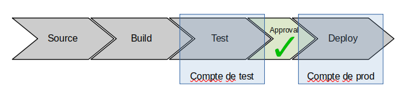

ici une vue des composants AWS correspondants:

cf [https://github.com/awslabs/aws-refarch-cross-account-pipeline](https://github.com/awslabs/aws-refarch-cross-account-pipeline)

####  Etapes

Pour arriver à ce résultat final, nous allons procéder par étapes :

- Une pipeline "simple", qui build et déploie la fonction lambda dans le compte courant, correspondant à [l'implémentation d'exemple AWS suivante](https://github.com/aws-samples/aws-lambda-sample-applications/tree/master/CICD-toolchain-for-serverless-applications)
  -  On rajoutera des tests d'intégration en "pre-traffic hook", c'est à dire se déclanchant après le déploiement mais avant la redirection du traffic sur la nouvelle version
- Rajout d'un étape de "test" à la pipeline précédente, déployant l'application dans un autre compte AWS, dédié au test
- Version finale de la pipeline, correspondant à [l'architecture de référence pour les déploiement cross-account](https://github.com/awslabs/aws-refarch-cross-account-pipeline)

####  Plan de l'étape #1

Nous procèderons de manière incrémentale pour implémenter chaque étape.
Ainsi nous subdiviserons la réalisation de l'étape #1 dans les sous-étapes suivantes:

- 1.1 - Implémentation des étapes "Source" + "Build" bouchonné
- 1.2 - Implémentation de l'application `Lambda` en Java
- 1.3 - Intégration du code application et de la pipeline
- 1.4 - (Bonus) Implémentation de tests automatisés pour la création de la pipeline

Pour éviter le "Big Design Upfront", source de stagnation, de frustration, et de toute manière très vite périmé en pratique, nous verrons le moment venu le détail des subdivisions entre les étapes #1 et #2, et entre les étapes #2 et #3.

Dans un premier temps, avoir une idée claire des grandes étapes est suffisant.

Le plan de l'implémentation de cette étape #1 pouvant lui-même évoluer au cours de l'implémentation, restons agiles et pragmatiques.

####  Plan de l'article

Dans cet article, nous allons réaliser l'étape 1.1 décrite dans la section précédente: "1.1 - Implémentation des étapes "Source" + "Build" bouchonné".

Nous allons dans un premier temps implémenter ce début de pipeline manuellement, ensuite nous allons l'automatiser via ̀`CloudFormation`

Voici les ressources AWS qui seront créées:

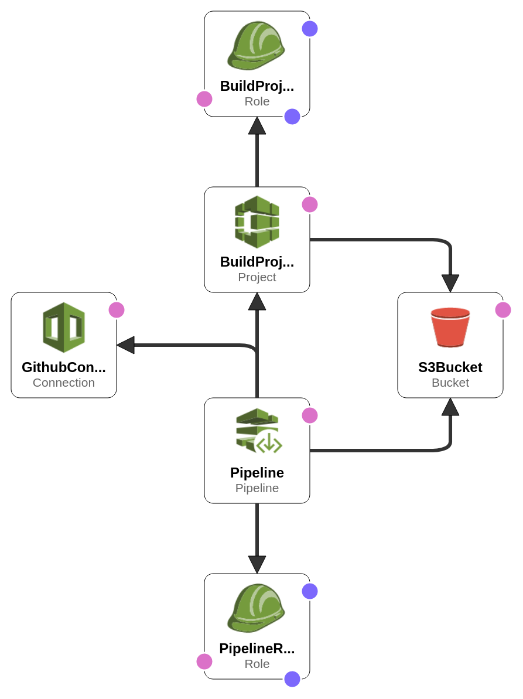

###  Implémentation Manuelle

Nous allons procéder de la manière suivante pour l'implémentation manuelle

1. création du bucket S3
2. création de la pipeline `CodePipeline`
  + 2.1 source: création de la connexion github
  + 2.2 build: création du projet codebuild
4. lancement de la pipeline
3. correction du role IAM pour `CodeBuild`
5. inspection du bucket S3 et vérification de la présence des sources

======

0. création d'un repo github, avec un contenu arbitraire

Je vous laisse faire pour cela

1. création du bucket S3

Créez un bucket, avec le nom "serverless-cicd-bucket"

2. création de la pipeline `CodePipeline`

Cliquez sur "Create Pipeline" dans le dashboard de `CodePipeline`.

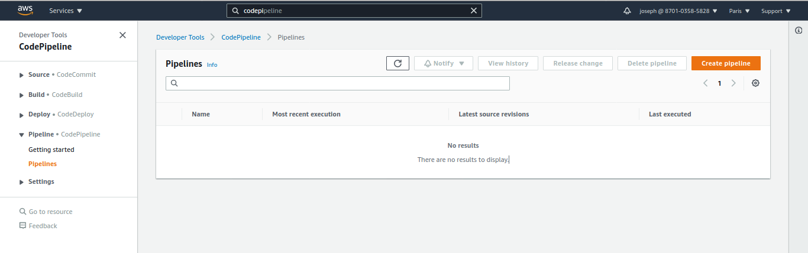

Donnez lui le nom "serverless-cicd-pipeline".

Laissez coché "New Service Role, à la limite, par soucis de cohérence dans le nommage, on pourra le renommer en "serverless-cicd-pipeline-role".

Laissez coché "Allow AWS CodePipeline to create a service role so it can be used with this new pipeline"

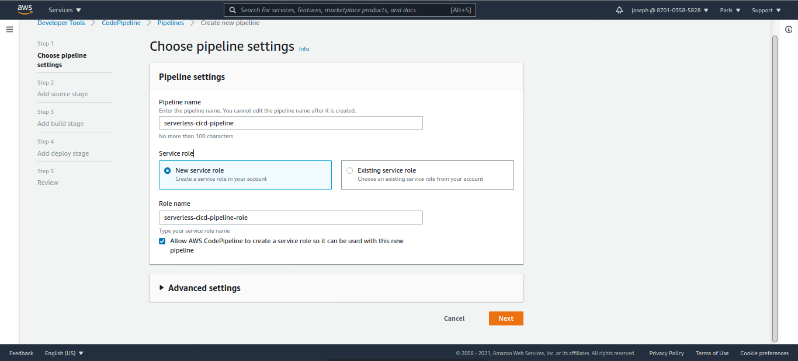

Ensuite, dans "Advanced Settings", "Artifact Store", sélectionnez "Custom Location" et sélectionnez le bucket "serverless-cicd-bucket"

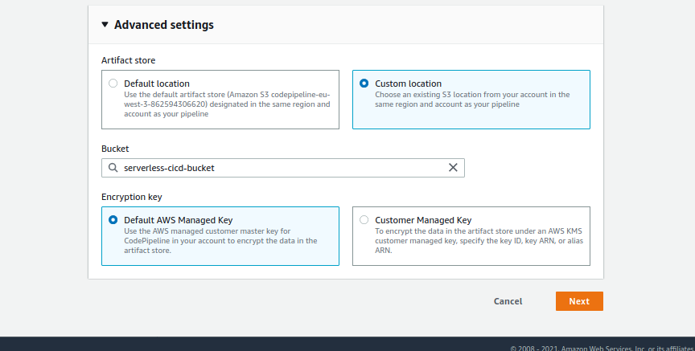

Laissez "Encryption Key" à "Default AWS Managed Key". Nous modifierons cela lors de l'implémentation de l'étape #2, pour le moment elle peut garder la valeur par défaut.

Cliquez sur "Suivant":

"Source Provider", sélectionnez "Github (Version 2)"

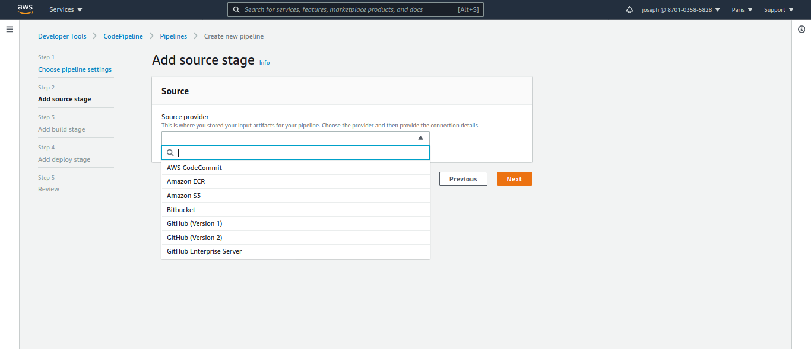

"Connection" >> "Connect to Github"

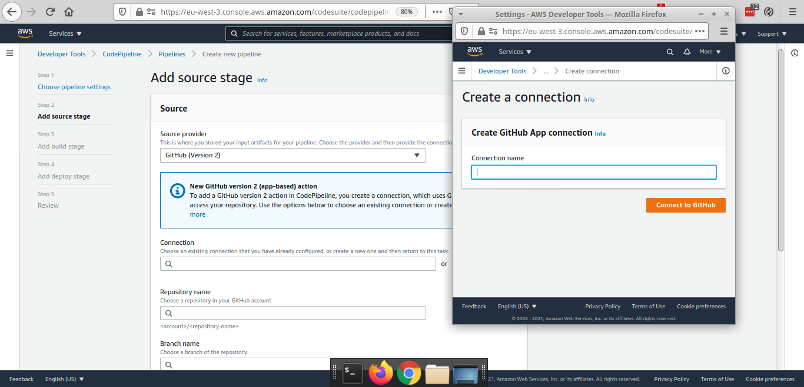

Donnez un nom à la connexion, là aussi, pour rester cohérent avec le nommage "serverless-cicd-XXX", par exemple "serverless-cicd-github-connect" (la longueur du nom de la connexion doit être inférieure à 32 caractères)

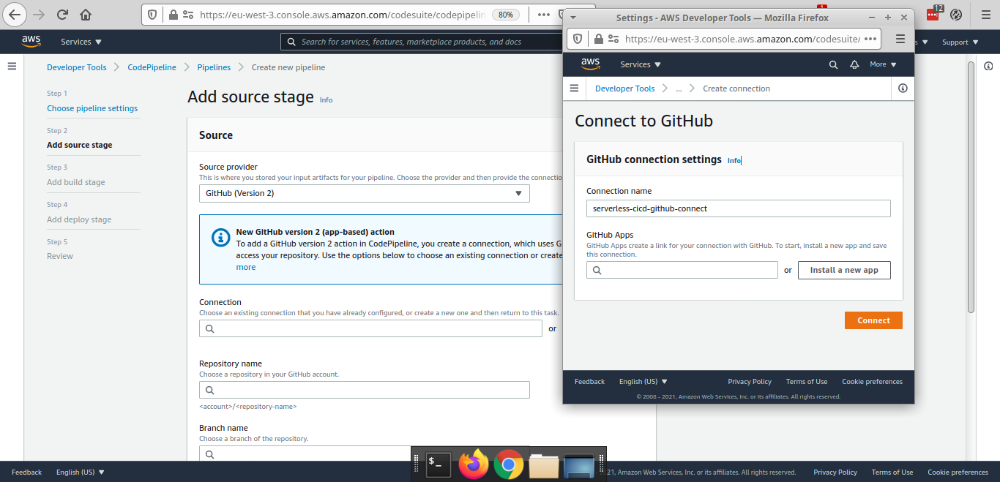

Sélectionnez la "GitHub App" si vous en avez deja installé une, sinon, cliquez sur "Install a new app", cela vous amène à l'écran de consentement suivant:

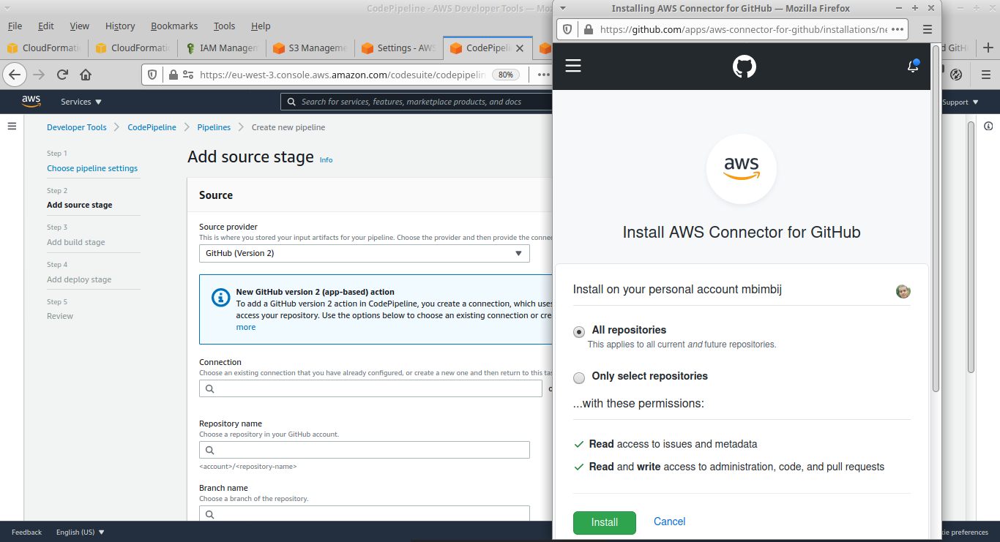

Pour simplifier les choses dans ce tutorial, nous allons autoriser l'accès de AWS à tous les repos de notre compte et laisser "All repositories" coché.

Cliquez sur "Install", cela vous ramène à l'écran précédent, mais avec un id de "GitHub App" présélectionné: 

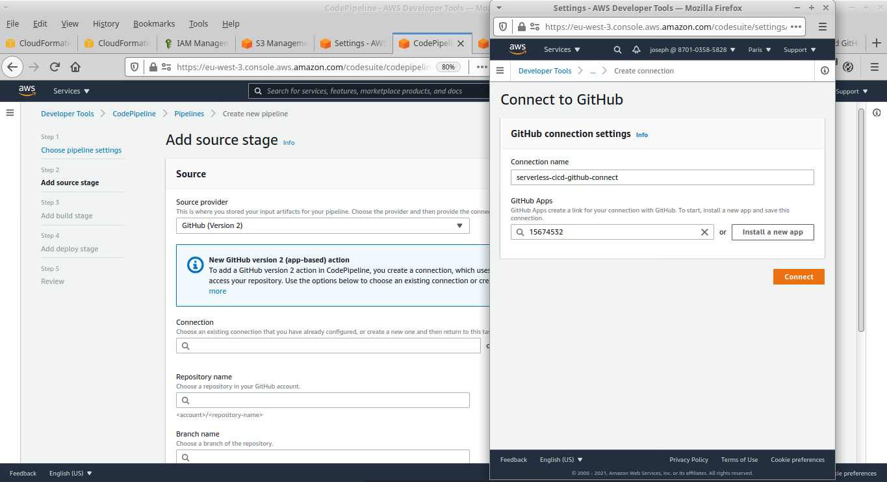

Cliquez sur "Connect".

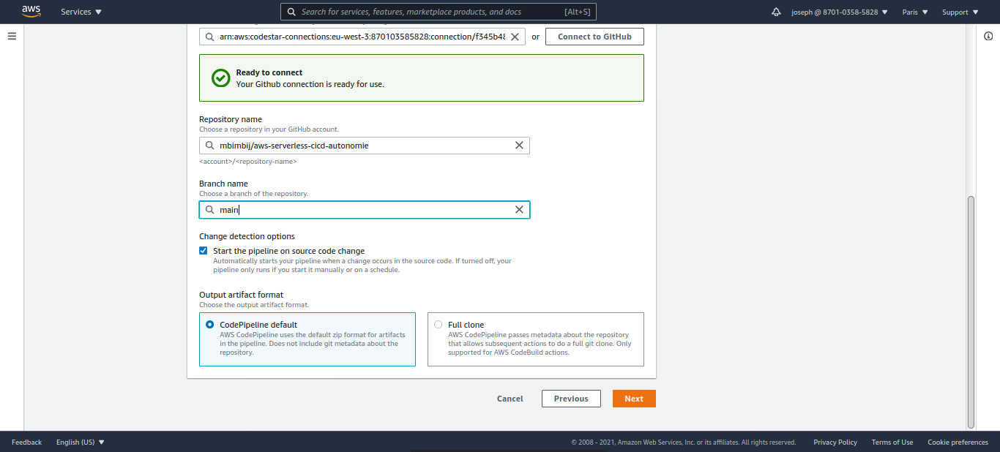

Ensuite, sélectionnez le repo et la branche sur laquelle `CodePipeline` va s'appuyer.
Laissez toutes les autres options par défaut et cliquez sur "Suivant".

Vous arriverez sur l'écran suivant:

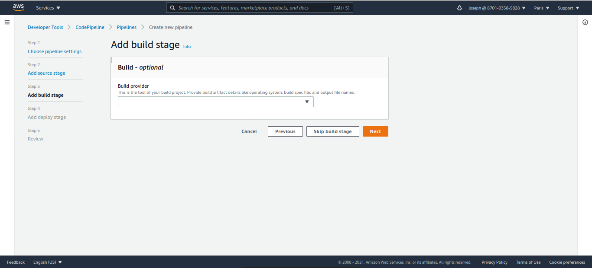

Sélectionnez `CodeBuild` en "Build Provider"

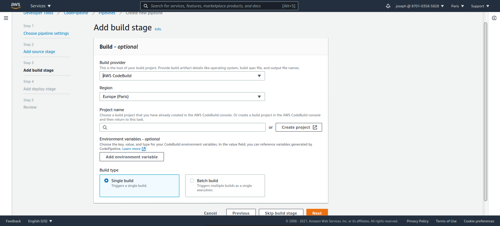

à droite de "Project Name", cliquez sur "Create Project". Cela va ouvrir une popup:

- nom du projet: là aussi, on va suivre notre mini convention de nommage et l'on pourra par exemple donner le nom "serverless-cicd-codbuild"

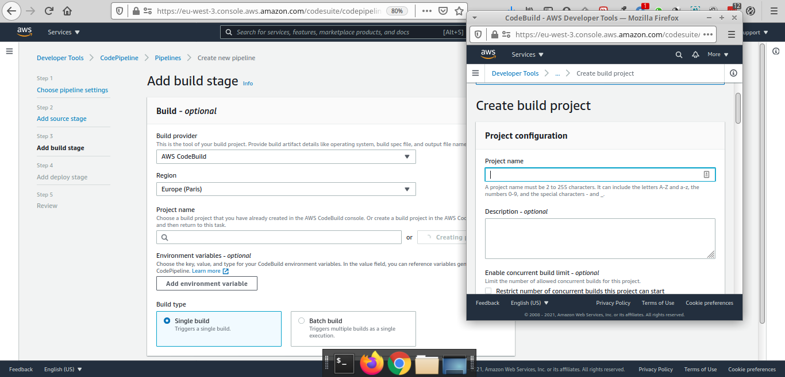

Ensuite remplissez les champs suivants:

- "Operating System": "Amazon Linux 2"
- "Runtime(s)": "Standard"
- "Image": "aws/codebuild/amazonlinux2-x86_64-standard:3.0"

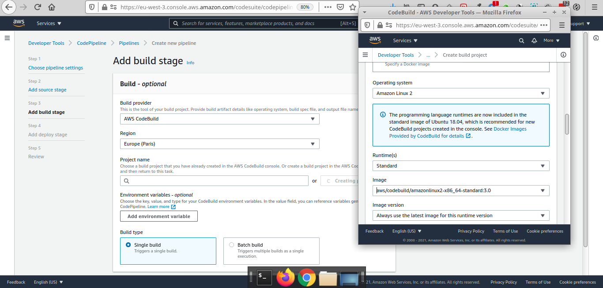

- "Build commands": `echo "hello world !"`

On s'occupera de créer un projet `CodeBuild` approprié dans un second temps. Pour le moment, on cherche à avoir une pipeline minimale fonctionnelle, et `CodePipeline` ne permet pas de créer une pipeline avec un seul stage, qui aurait été "Source", avec la connexion GitHub. 

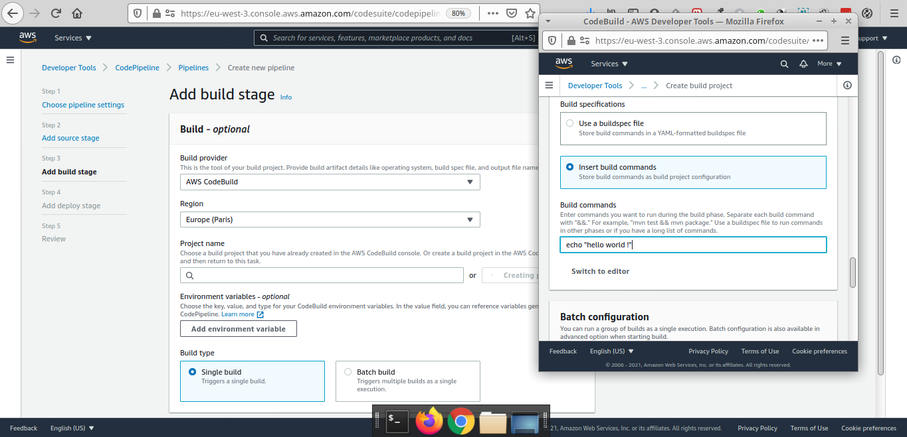

Ensuite, "Continue to CodePipeline".

Ensuite, Click on "Next".

Ensuite, cliquez sur "Skip deploy stage". Confirmez.

Ensuite "Create pipeline"

Vous serez amené à l'écran suivant, et la pipeline sera immédiatement déclenchée:

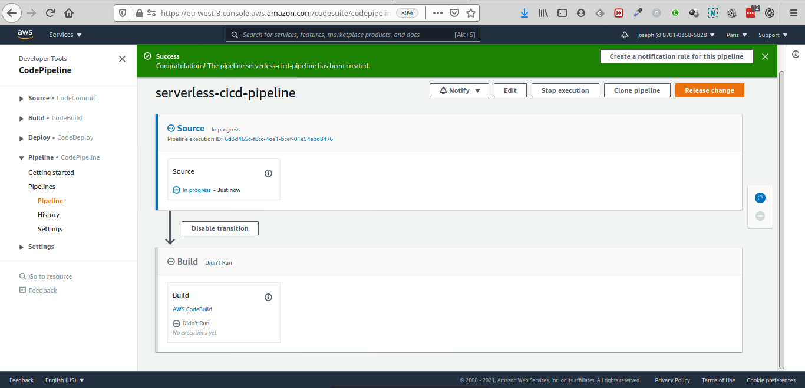

La pipeline devrait être en erreur au niveau du stage "Build"

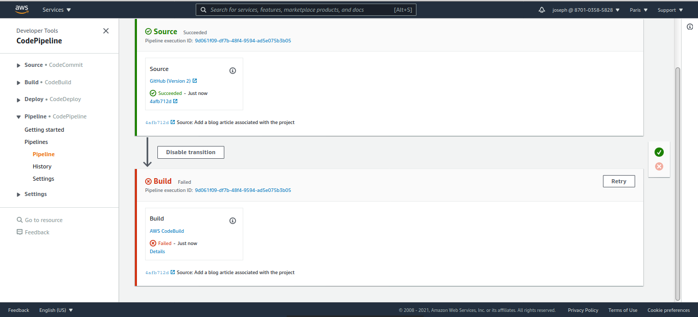

Inspectons les détails et allons regarder les logs :

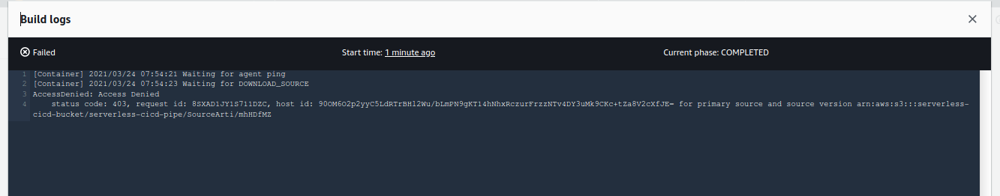

On constate la présence d'un `Access Denied`. AWS vient avec son lot de pièges, de surprises, parfois de contradictions, avec des messages d'erreurs pas toujours très explicites. 

D'autres joyeuseries de ce genre apparaitront en cours de route ...

Allons regarder les droits positionnés sur le rôle attribué à `CodeBuild` 

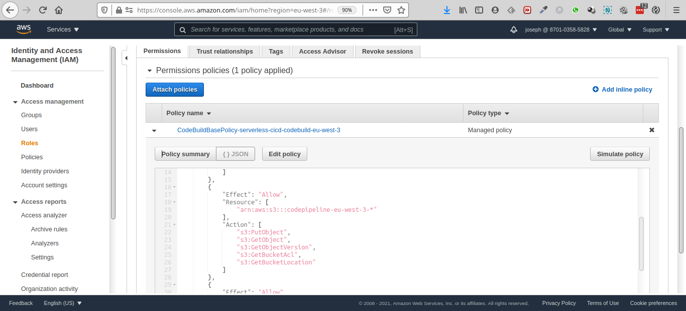

Comme vous pouvez le voir, lors de la création du projet `CodeBuild`, des droits ont été attribués pour un bucket dont le nom est "codepipeline-eu-west-3-*", qui est le nom donné si on configure le wizard pour créer le bucket, or nous l'avons créé manuellement en amont, avec un nom différent du wizard, dommage que ce nom semble avoir été placé en dur, et qu'il ne soit pas configuré pour récupérer le nom du bucket que l'on a entré.  

Corrigeons cela: remplacez `"arn:aws:s3:::codepipeline-eu-west-3-*"` par `"arn:aws:s3:::serverless-cicd-bucket/*"`

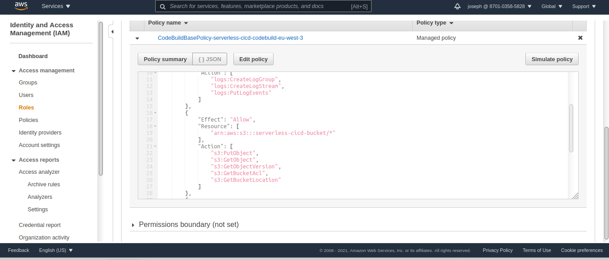

Maintenant réessayons l'étape de Build, celle-ci devrait s'éxécuter avec succès:

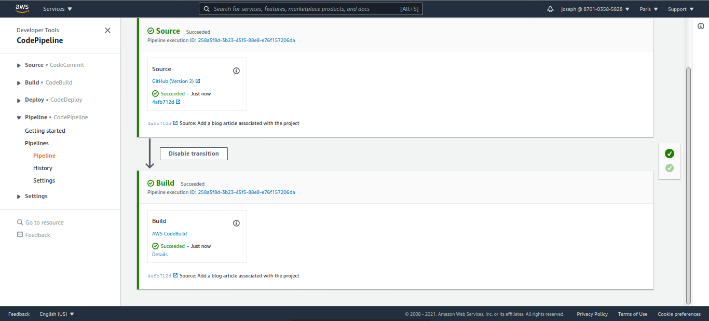

Et allons inspecter les logs de `CodeBuild`:

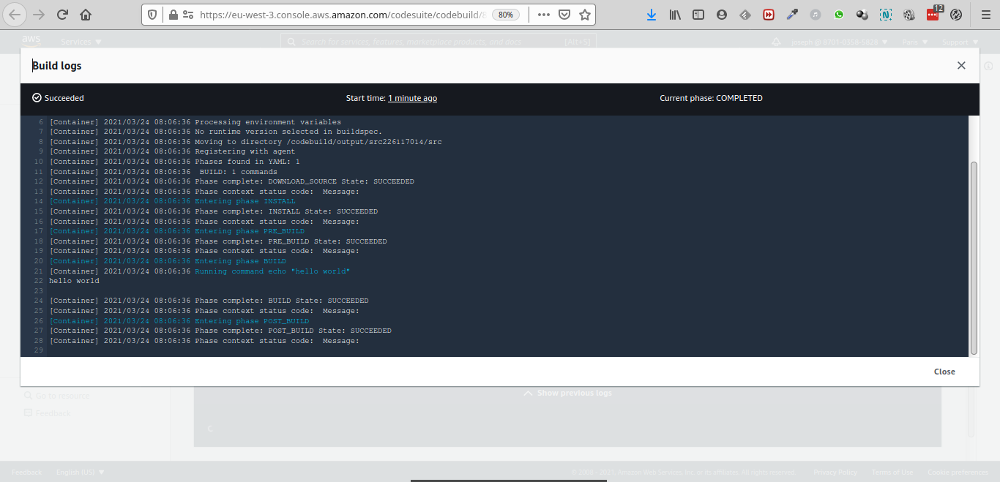

On peut voir que les logs sont ok, ainsi que la présence de la log liée à notre commande `echo "hello world"`.

Parfait parfait, allons inspecter le bucket S3 et vérifier la présence du contenu de notre repo GitHub: 

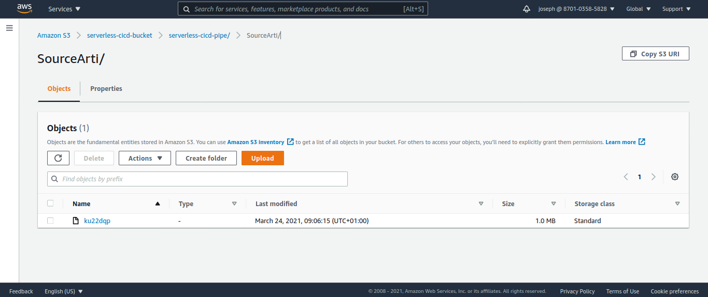

Téléchargeons l'item et dézippeons-le:

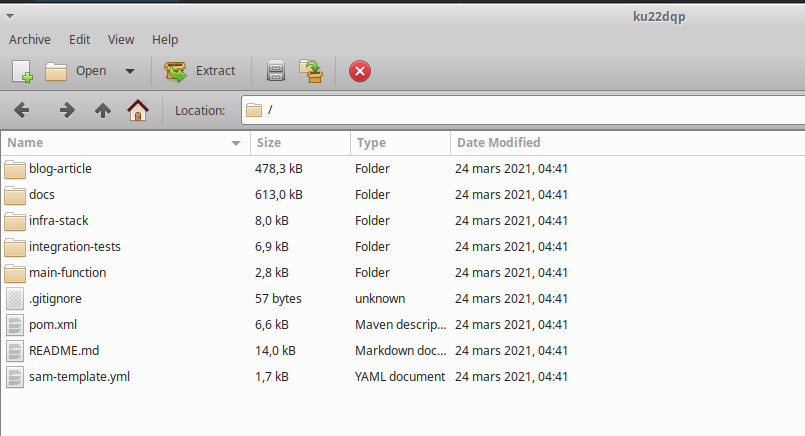

Il s'agit bien du contenu de notre repository. 

Mission accomplie !! Nous avons crée un début de pipeline récupérant les sources et les plaçant dans le buclek S3 pour être utilisé par les autres étapes et éléments du pipeline. 

Prochaine étape, automatisation de tout cela.

Pensez à copier en quelque part les policies IAM des rôles `serverless-cicd-pipeline-role` et `serverless-cicd-codebuild-role`, respectivement associés à nos projets `CodePipeline` et `CodeBuild`

###  Automatisation avec `CloudFormation`

Supprimez les ressources créées au cours de la section "Implémentation manuelle" si ça n'est pas deja fait (vous pouvez vous référer au diagramme décrivant les ressources créées, dans la section "plan de l'article", juste avant "Implémentation Manuelle".

Cela afin d'éviter les conflits de nom avec celles que l'on créera via`CloudFormation`.