---
title: Implémentation d'une pipeline CI/CD pour des application AWS Serverless - partie 1
date: 12:30 03/23/2021
author: Joseph M'Bimbi-Bene
hero_classes: 'text-light overlay-dark-gradient'
hero_image: article-logo.png
taxonomy:
    category: blog
    tag: [devops, cloud, serverless]
---

Dans cette article, nous allons implémenter et faire évoluer une pipeline de CI/CD reproduisant les exemples et architectures de référence fournis par AWS.

===

Cet article est le premier d'une série.

- [partie 2](https://joseph-mbimbi.fr/blog/serverless-cicd-demo-2)
- [partie 3](https://joseph-mbimbi.fr/blog/serverless-cicd-demo-3)

Nous allons implémenter le début d'une pipeline de CI/CD, uniquement les étapes "Source" et "Build" bouchonnée, sans code applicatif.

Nous créerons la pipeline d'abord manuellement, via la console web. 
Ensuite nous automatiserons ce processus par un template CloudFormation.

Au prochain article, nous implémenterons le code de la fonction `Lambda` en java, et nous intégrerons le code applicatif à la pipeline.

### Sommaire

- [Introduction, Description du projet](#introduction-description-du-projet)
  * [Cible](#cible)
  * [Etapes](#etapes)
  * [Plan de l'étape #1](#plan-etape-1)
  * [Plan de l'article](#plan-article)
- [1. Implémentation Manuelle](#implementation-manuelle)
- [2. Automatisation avec `CloudFormation`](#automatisation-cloudformation)
- [Références](#references)

<small><i><a href='http://ecotrust-canada.github.io/markdown-toc/'>Table of contents generated with markdown-toc</a></i></small>


###  <a name="introduction-description-du-projet"></a> Introduction, Description du projet

Le but de cet série d'article est d'implémenter et de faire évoluer une pipeline de CI/CD reproduisant des exemples et 
architectures de référence fournis par AWS.

Ainsi, ce que l'on produira devrait être proches de "best practices", et l'on sera confiant dans ce que l'on a produit.

#### <a name="cible"></a> Cible

Au bout de cette série d'article, le résultat final produit devrait ressembler à :

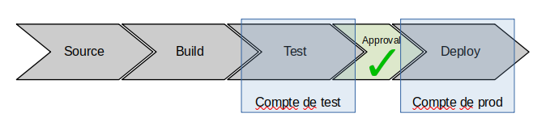

ici une vue des composants AWS correspondants:

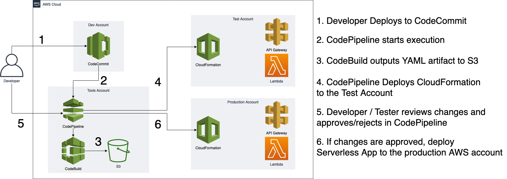

cf [https://github.com/awslabs/aws-refarch-cross-account-pipeline](https://github.com/awslabs/aws-refarch-cross-account-pipeline)

#### <a name="etapes"></a> Etapes

Pour arriver à ce résultat final, nous allons procéder par étapes :

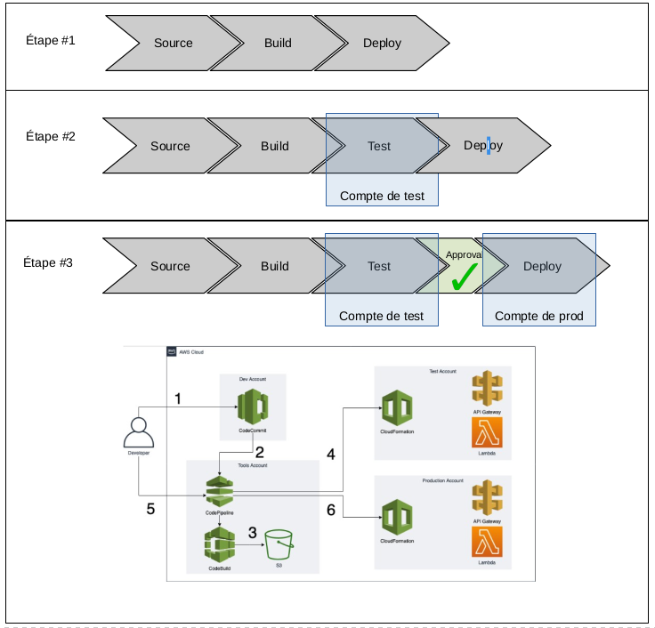

- Une pipeline "simple", qui build et déploie la fonction lambda dans le compte courant, correspondant à [l'implémentation d'exemple AWS suivante](https://github.com/aws-samples/aws-lambda-sample-applications/tree/master/CICD-toolchain-for-serverless-applications)
  -  On rajoutera des tests d'intégration en "pre-traffic hook", c'est à dire se déclanchant après le déploiement mais avant la redirection du traffic sur la nouvelle version
- Rajout d'un étape de "test" à la pipeline précédente, déployant l'application dans un autre compte AWS, dédié au test
- Version finale de la pipeline, correspondant à [l'architecture de référence pour les déploiement cross-account](https://github.com/awslabs/aws-refarch-cross-account-pipeline)

#### <a name="plan-etape-1"></a> Plan de l'étape #1

Nous procèderons de manière incrémentale pour implémenter chaque étape.
Ainsi nous subdiviserons la réalisation de l'étape #1 dans les sous-étapes suivantes:

- 1.1 - Implémentation des étapes "Source" + "Build" bouchonné
- 1.2 - Implémentation de l'application `Lambda` en Java
- 1.3 - Intégration du code application et de la pipeline
- 1.4 - (Bonus) Implémentation de tests automatisés pour la création de la pipeline

Pour éviter le "Big Design Upfront", source de stagnation, de frustration, et de toute manière très vite périmé en pratique, nous verrons le moment venu le détail des subdivisions entre les étapes #1 et #2, et entre les étapes #2 et #3.

Dans un premier temps, avoir une idée claire des grandes étapes est suffisant.

Le plan de l'implémentation de cette étape #1 pouvant lui-même évoluer au cours de l'implémentation, restons agiles et pragmatiques.


#### <a name="plan-article"></a> Plan de l'article

Dans cet article, nous allons réaliser l'étape 1.1 décrite dans la section précédente: "1.1 - Implémentation des étapes "Source" + "Build" bouchonné".

Nous allons dans un premier temps implémenter ce début de pipeline manuellement, ensuite nous allons l'automatiser via ̀`CloudFormation`

Voici les ressources AWS qui seront créées:

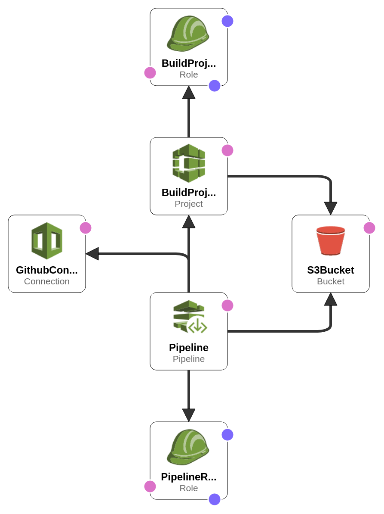

### <a name="implementation-manuelle"></a> 1. Implémentation Manuelle

Nous allons procéder de la manière suivante pour l'implémentation manuelle

1. création du bucket S3
2. création de la pipeline `CodePipeline`
  + 2.1 source: création de la connexion github
  + 2.2 build: création du projet codebuild
4. lancement de la pipeline
3. correction du role IAM pour `CodeBuild`
5. inspection du bucket S3 et vérification de la présence des sources

======

0. création d'un repo github, avec un contenu arbitraire

Je vous laisse faire pour cela

1. création du bucket S3

Créez un bucket, avec le nom "serverless-cicd-bucket"

2. création de la pipeline `CodePipeline`

Cliquez sur "Create Pipeline" dans le dashboard de `CodePipeline`.

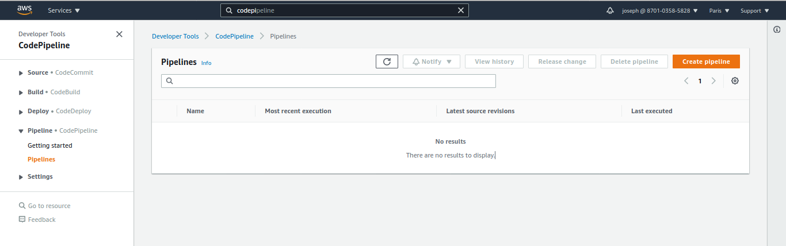

Donnez lui le nom "serverless-cicd-pipeline".

Laissez coché "New Service Role, à la limite, par soucis de cohérence dans le nommage, on pourra le renommer en "serverless-cicd-pipeline-role".

Laissez coché "Allow AWS CodePipeline to create a service role so it can be used with this new pipeline"

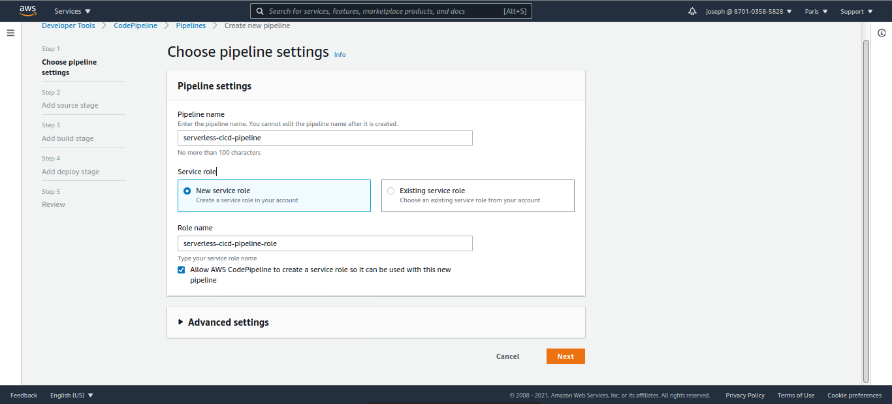

Ensuite, dans "Advanced Settings", "Artifact Store", sélectionnez "Custom Location" et sélectionnez le bucket "serverless-cicd-bucket"

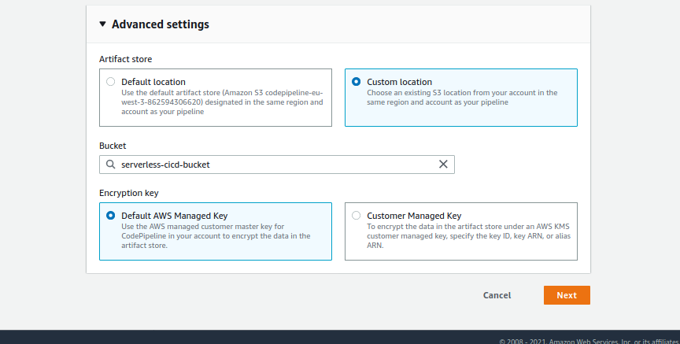

Laissez "Encryption Key" à "Default AWS Managed Key". Nous modifierons cela lors de l'implémentation de l'étape #2, pour le moment elle peut garder la valeur par défaut.

Cliquez sur "Suivant":

### <a name="creation-connexion-github"></a> 2.1 source: création de la connexion github

"Source Provider", sélectionnez "Github (Version 2)"

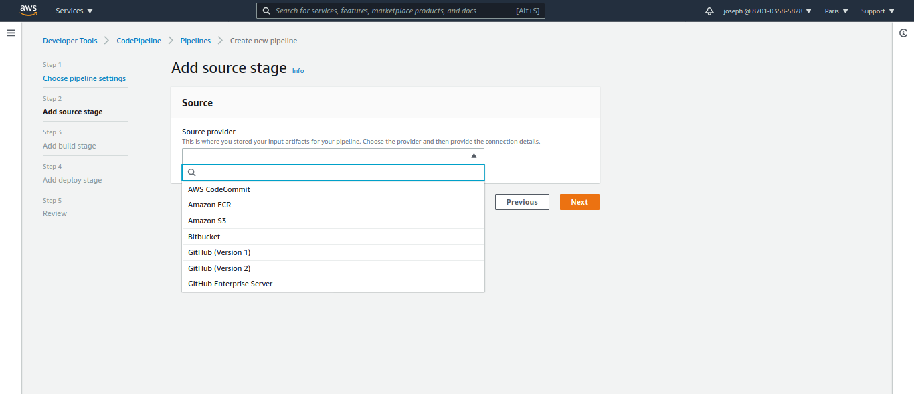

"Connection" >> "Connect to Github"

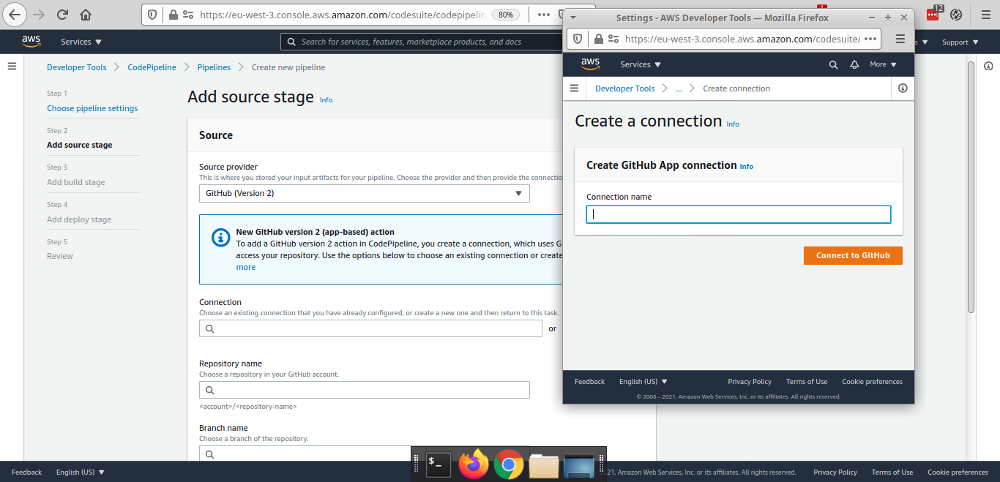

Donnez un nom à la connexion, là aussi, pour rester cohérent avec le nommage "serverless-cicd-XXX", par exemple "serverless-cicd-github-connect" (la longueur du nom de la connexion doit être inférieure à 32 caractères)

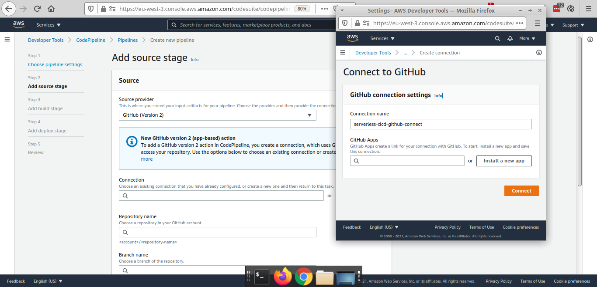

Sélectionnez la "GitHub App" si vous en avez deja installé une, sinon, cliquez sur "Install a new app", cela vous amène à l'écran de consentement suivant:

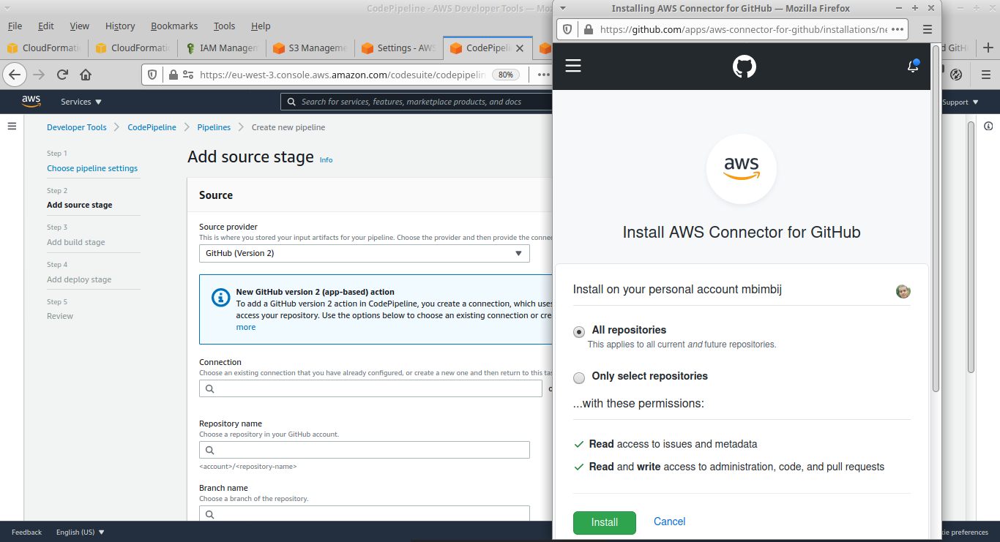

Pour simplifier les choses dans ce tutorial, nous allons autoriser l'accès de AWS à tous les repos de notre compte et laisser "All repositories" coché.

Cliquez sur "Install", cela vous ramène à l'écran précédent, mais avec un id de "GitHub App" présélectionné: 

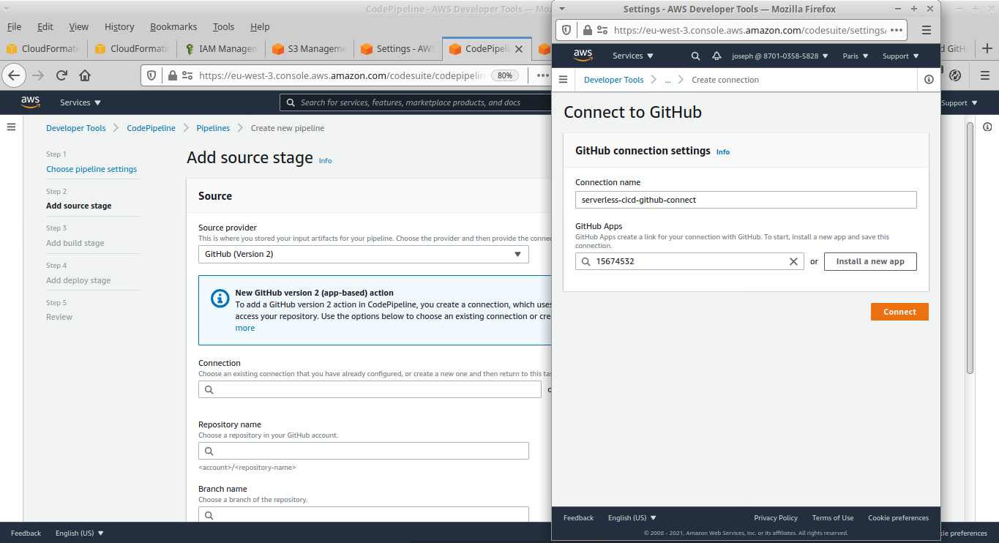

Cliquez sur "Connect".

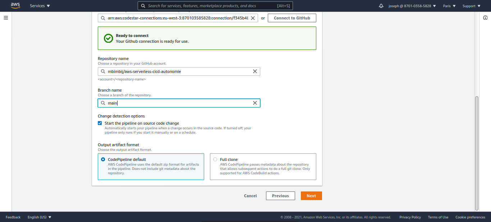

Ensuite, sélectionnez le repo et la branche sur laquelle `CodePipeline` va s'appuyer.
Laissez toutes les autres options par défaut et cliquez sur "Suivant".

Vous arriverez sur l'écran suivant:

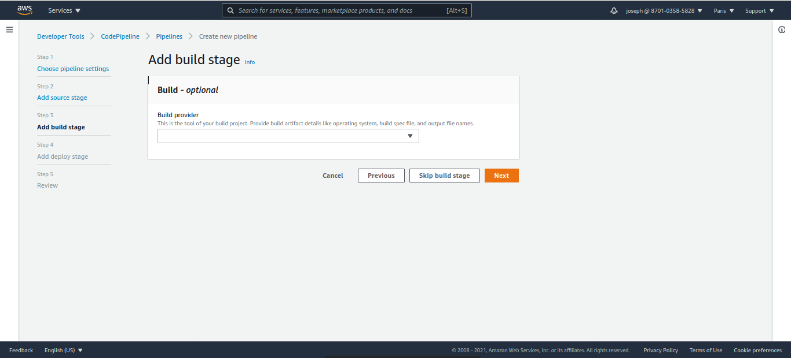

### <a name="creation-projet-codebuild"></a> 2.2 build: création du projet codebuild

Sélectionnez `CodeBuild` en "Build Provider"

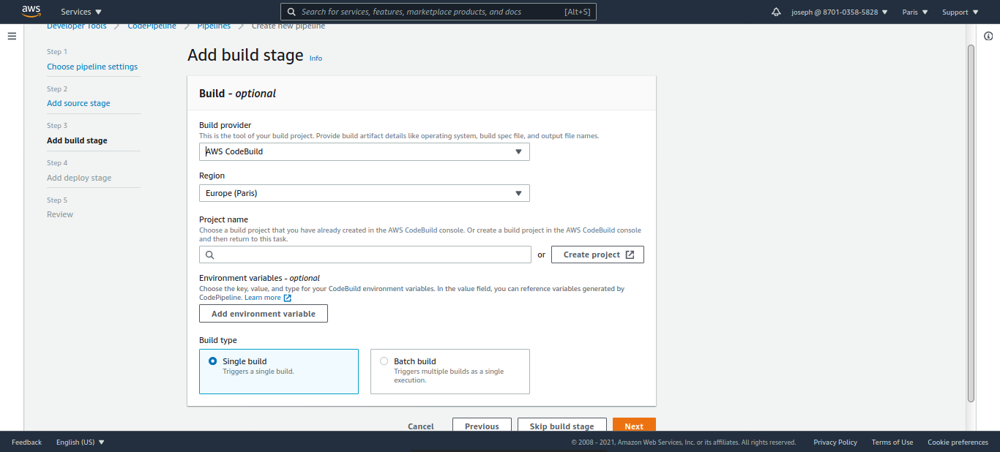

à droite de "Project Name", cliquez sur "Create Project". Cela va ouvrir une popup:

- nom du projet: là aussi, on va suivre notre mini convention de nommage et l'on pourra par exemple donner le nom "serverless-cicd-codbuild"

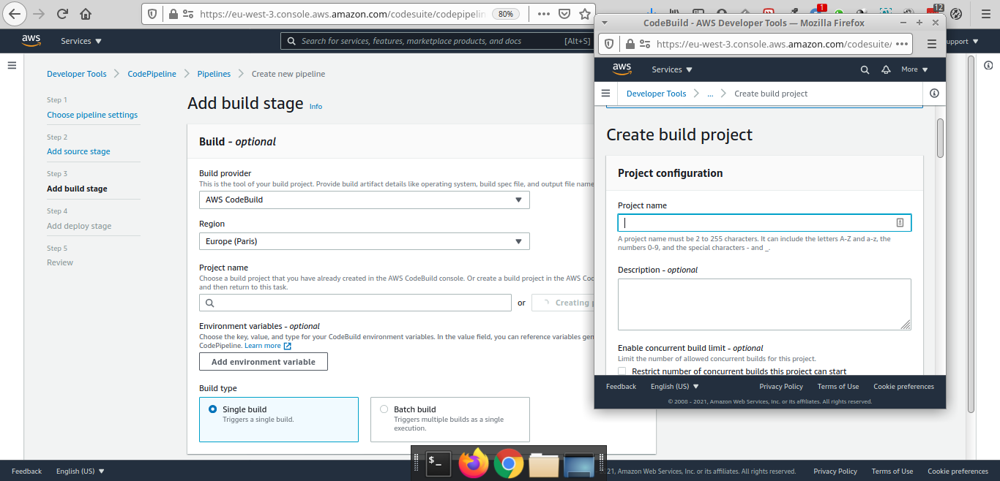

Ensuite remplissez les champs suivants:

- "Operating System": "Amazon Linux 2"
- "Runtime(s)": "Standard"
- "Image": "aws/codebuild/amazonlinux2-x86_64-standard:3.0"

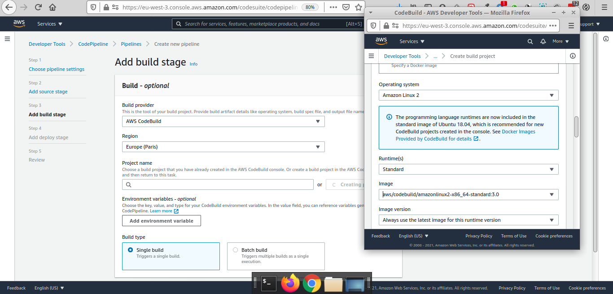

- "Build commands": `echo "hello world !"`

On s'occupera de créer un projet `CodeBuild` approprié dans un second temps. Pour le moment, on cherche à avoir une pipeline minimale fonctionnelle, et `CodePipeline` ne permet pas de créer une pipeline avec un seul stage, qui aurait été "Source", avec la connexion GitHub. 

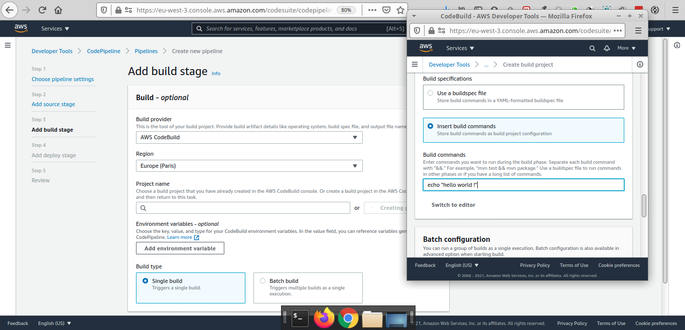

Ensuite, "Continue to CodePipeline".

Ensuite, Click on "Next".

Ensuite, cliquez sur "Skip deploy stage". Confirmez.

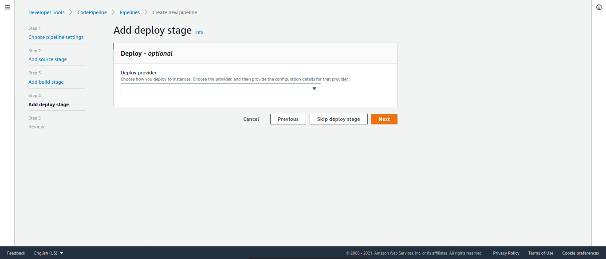

Ensuite "Create pipeline"

Vous serez amené à l'écran suivant, et la pipeline sera immédiatement déclenchée:

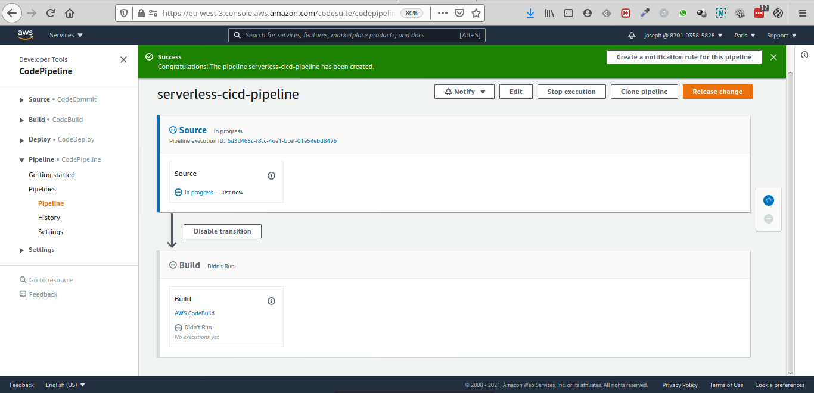

La pipeline devrait être en erreur au niveau du stage "Build"

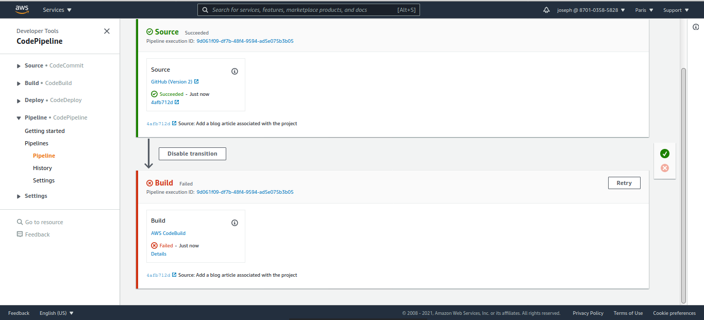

Inspectons les détails et allons regarder les logs :

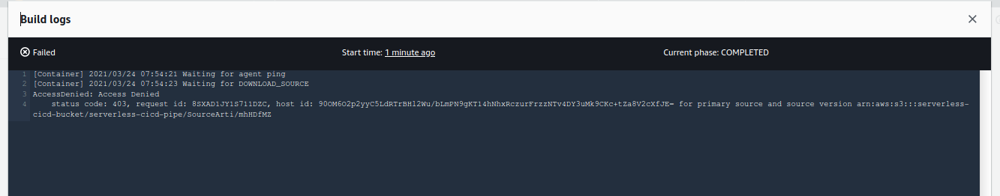

On constate la présence d'un `Access Denied`. AWS vient avec son lot de pièges, de surprises, parfois de contradictions, avec des messages d'erreurs pas toujours très explicites. 

D'autres joyeuseries de ce genre apparaitront en cours de route ...

Allons regarder les droits positionnés sur le rôle attribué à `CodeBuild` 

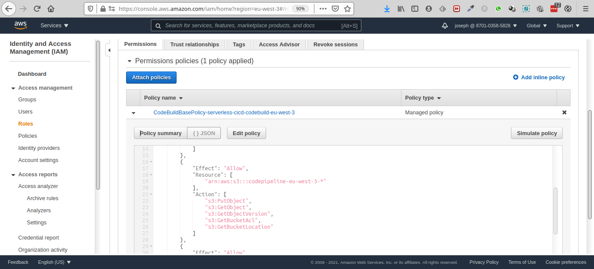

Comme vous pouvez le voir, lors de la création du projet `CodeBuild`, des droits ont été attribués pour un bucket dont le nom est "codepipeline-eu-west-3-*", qui est le nom donné si on configure le wizard pour créer le bucket, or nous l'avons créé manuellement en amont, avec un nom différent du wizard, dommage que ce nom semble avoir été placé en dur, et qu'il ne soit pas configuré pour récupérer le nom du bucket que l'on a entré.  

Corrigeons cela: remplacez `"arn:aws:s3:::codepipeline-eu-west-3-*"` par `"arn:aws:s3:::serverless-cicd-bucket/*"`

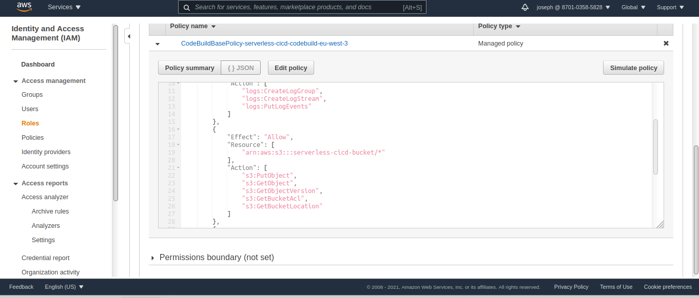

Maintenant réessayons l'étape de Build, celle-ci devrait s'éxécuter avec succès:

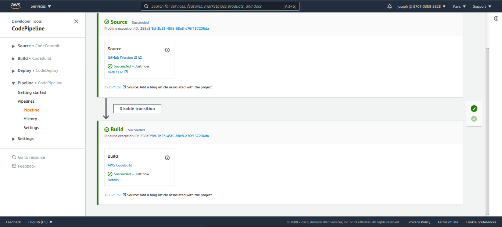

Et allons inspecter les logs de `CodeBuild`:

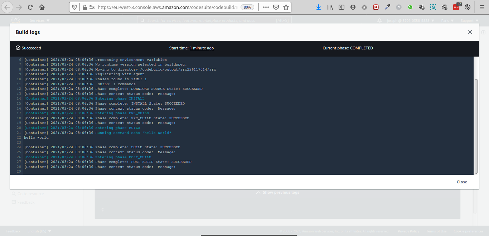

On peut voir que les logs sont ok, ainsi que la présence de la log liée à notre commande `echo "hello world"`.

Parfait parfait, allons inspecter le bucket S3 et vérifier la présence du contenu de notre repo GitHub: 

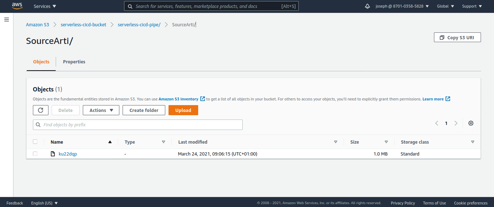

Téléchargeons l'item et dézippeons-le:


Il s'agit bien du contenu de notre repository. 

Mission accomplie !! Nous avons crée un début de pipeline récupérant les sources et les plaçant dans le buclek S3 pour être utilisé par les autres étapes et éléments du pipeline. 

Prochaine étape, automatisation de tout cela.

Pensez à copier en quelque part les policies IAM des rôles `serverless-cicd-pipeline-role` et `serverless-cicd-codebuild-role`, respectivement associés à nos projets `CodePipeline` et `CodeBuild`

### <a name="automatisation-cloudformation"></a> 2. Automatisation avec `CloudFormation`

Supprimez les ressources créées au cours de la section "Implémentation manuelle" si ça n'est pas deja fait (vous pouvez vous référer au diagramme décrivant les ressources créées, dans la section "plan de l'article", juste avant "Implémentation Manuelle".

Cela afin d'éviter les conflits de nom avec celles que l'on créera via`CloudFormation`.

Vous pouvez utiliser le repo github suivant pour suivre cette partie du tutorial, ou vous repositionner sur une version fonctionnelle si jamais vous vous perdez (ce qui m'arrive quand je suis de tutos ^^) :
[https://github.com/mbimbij/aws-serverless-cicd-demo](https://github.com/mbimbij/aws-serverless-cicd-demo)

Au lieu de balancer le template au complet immédiatement, soit toute une tartine indigeste de yaml et dire "voici l'implémentation, bisou", ce qui assez peu adapté et efficace pour transmettre, et surtout pour acquérir des connaissances, nous allons  procéder étape par étape, et ajouter à notre stack `CloudFormation` les ressources une à une.

Comme le dit un certain proverbe: 
"comment avaler un éléphant ?"
"une cuillère à la fois"

Que ce soit du code applicatif, du code d'infra, ou encore l'élaboration de specs, "baby steps" est une règle d'or.

### <a name="cloudformation-s3"></a> 2.1 Automatisation - bucket S3

La "correction" est disponible sur le tag `step1.1.1_S3-bucket` du repository de support.

Nous allons créer un bucket S3 ayant le nom "XXX-pipeline-bucket", où "XXX" est un préfixe défini de la manière suivante :

- la région
- l'id du compte AWS
- le nom de l'application, donné en paramètre du template, et ayant pou valeur par défaut "serverless-cicd"

Ce qui donne le template suivant: 

```yaml
Parameters:
  ApplicationName:
    Default: 'serverless-cicd'
    Type: String
    Description: Application Name


Resources:
  S3Bucket:
    Type: 'AWS::S3::Bucket'
    Description: S3 bucket for pipeline artifacts
    Properties:
      BucketName: !Join
        - '-'
        - - !Ref 'AWS::Region'
          - !Ref 'AWS::AccountId'
          - !Ref ApplicationName
          - bucket-pipeline
```

Ca a le mérite d'être relativement digeste et analysable, contrairement à un résultat final de plus de X centaines de lignes.

Lancez la création de la stack via la commande: 

`aws cloudformation update-stack --stack-name serverless-cicd-pipeline-stack --template-body file://pipeline-stack.yml --parameters ParameterKey=ApplicationName,ParameterValue=serverless-cicd --capabilities CAPABILITY_NAMED_IAM`

Le nom de l'application est redondant, vous pouvez le supprimer si vous le voulez.

Vous pouvez suivre l'avancée de l'éxécution du template dans la console web de `CloudFormation`:

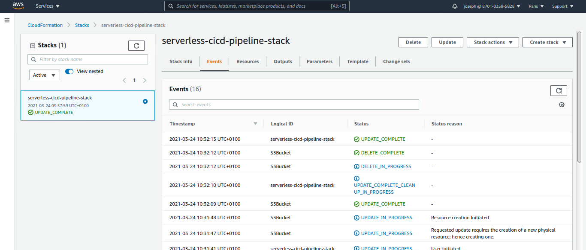

et cliquez sur l'icône en haut à droite pour rafraîchir la vue.

Vous pouvez aller dans l'interface de S3 pour vérifier la création du bucket:

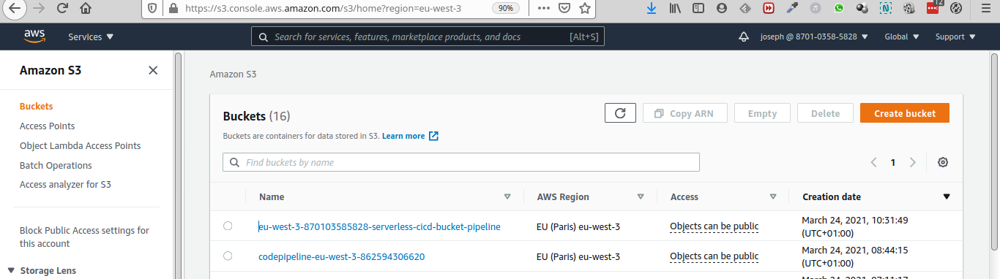

Tout a l'air bon. 

### <a name="cloudformation-github-connection"></a> 2.2 Automatisation - connexion Github

La "correction" est disponible sur le tag `step1.1.2_github-connection` du repository de support.

Ajoutez l'élément suivant en sous-élément de "Resources" du yaml:

```yaml
GithubConnection:
  Type: AWS::CodeStarConnections::Connection
  Properties:
    ConnectionName: !Join
      - '-'
      - - !Ref ApplicationName
        - conn
    ProviderType: GitHub
```

Updatez la stack via la commande `aws cloudformation update-stack --stack-name serverless-cicd-pipeline-stack --template-body file://pipeline-stack.yml --capabilities CAPABILITY_NAMED_IAM`

Vérifiez l'update de la stack dans la console de `CloudFormation`:

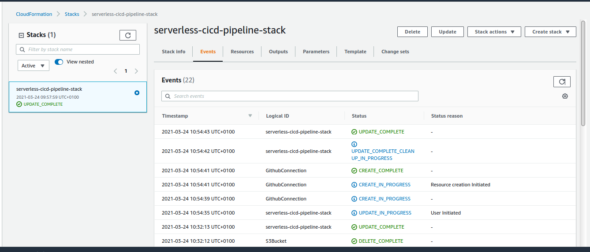

Vérifiez ensuite la création de la connexion github:

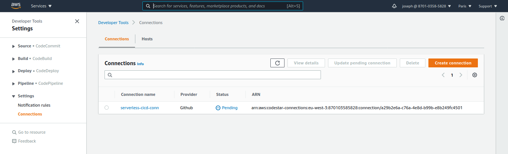

Notez que le status est "Pending", il faut activer la connexion manuellement, même si elle a été créée via `CloudFormation`. C'est apparemment un comportement "normal", et documenté : [https://docs.aws.amazon.com/dtconsole/latest/userguide/connections-update.html](https://docs.aws.amazon.com/dtconsole/latest/userguide/connections-update.html)

Allez dans la connexion, et cliquez sur "Update pending connection" :

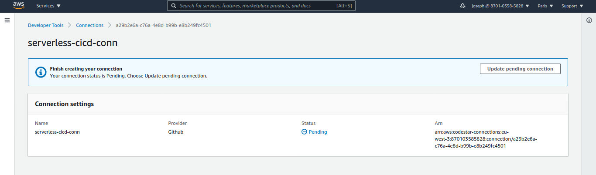

Une popup s'ouvre, sélectionnez la "GitHub App" créée précédemment (dans la section "Implémentation Manuelle"), sinon créez-en une, c'est facile et rapide. Il ne devrait y avoir aucun piège. 

Ensuite cliquez sur "Connect", fermez la popup, rechargez la page, et la connexion devrait désormais avoir un status "Available":

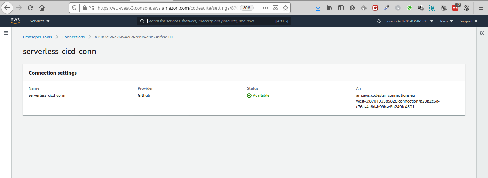

### <a name="cloudformation-role-codebuild"></a> 2.3 Automatisation - rôle IAM pour `CodeBuild`

La "correction" est disponible sur le tag `step1.1.3_codebuild-role` du repository de support.

Voir [https://docs.aws.amazon.com/AWSCloudFormation/latest/UserGuide/aws-resource-iam-role.html](https://docs.aws.amazon.com/AWSCloudFormation/latest/UserGuide/aws-resource-iam-role.html) pour la documentation de la ressource `IAM::Role` de `CloudFormation`.

Nous allons maintenant introduire une ressource `CloudFormation` pour la création du rôle IAM utilisé par le projet `CodeBuild` :

```yaml
BuildProjectRole:
  Type: 'AWS::IAM::Role'
  Description: IAM role for build resource
  Properties:
    RoleName: !Join
      - '-'
      - - !Ref ApplicationName
        - build-role
    Path: /
    Policies:
      - PolicyName: !Join
          - '-'
          - - !Ref ApplicationName
            - build-policy
        PolicyDocument:
          Statement:
            - Effect: Allow
              Action: 
                - s3:PutObject
                - s3:GetObject
                - s3:GetObjectVersion
                - s3:GetBucketAcl
                - s3:GetBucketLocation
              Resource:
                - !Sub 'arn:${AWS::Partition}:s3:::${S3Bucket}'
                - !Sub 'arn:${AWS::Partition}:s3:::${S3Bucket}/*'
            - Effect: Allow
              Action:
                - logs:CreateLogGroup
                - logs:CreateLogStream
                - logs:PutLogEvents
              Resource: arn:aws:logs:*:*:*
    AssumeRolePolicyDocument:
      Statement:
        - Action: "sts:AssumeRole"
          Effect: Allow
          Principal:
            Service:
              - codebuild.amazonaws.com
```

Description rapide:

- `BuildProjectRole.Properties.RoleName` : le nom du rôle. Voir [https://docs.aws.amazon.com/AWSCloudFormation/latest/UserGuide/intrinsic-function-reference-join.html](https://docs.aws.amazon.com/AWSCloudFormation/latest/UserGuide/intrinsic-function-reference-join.html) pour des détails sur la "fonction intrinsèque" `Join`.
- `BuildProjectRole.Properties.Path` : Pas sûr à 100%. Servirait à préfixer le nom du rôle, ou à le ranger dans une sorte de répertoire, pour de la gouvernance typiquement il semblerait. Plus d'information disponible ici: [https://docs.aws.amazon.com/IAM/latest/UserGuide/reference_identifiers.html](https://docs.aws.amazon.com/IAM/latest/UserGuide/reference_identifiers.html) 
- `BuildProjectRole.Properties.Policies` : autorisations et interdictions attribués au rôle et aux services qui vont l'endosser
  - accès au bucket `S3` 
  - création de logs dans `CloudWatch`
- `BuildProjectRole.Properties.Policies.[...].Resource` : la la "fonction intrinsèque" `Sub` fait de la substitution dans une chaîne de caractères. Voir [https://docs.aws.amazon.com/AWSCloudFormation/latest/UserGuide/pseudo-parameter-reference.html#cfn-pseudo-param-partition](https://docs.aws.amazon.com/AWSCloudFormation/latest/UserGuide/pseudo-parameter-reference.html#cfn-pseudo-param-partition) pour une présentation du "pseudo-paramètre" `AWS::Partition`. Il y en a un certain nombre d'autres. 
- `BuildProjectRole.Properties.AssumeRolePolicyDocument` : Définit quel type de "principal", soit quel type d'identité, a le droit d'assumer / endosser le rôle. Ici on définit que seul des "principaux" de type codebuild peuvent assumer le rôle.

### <a name="cloudformation-role-codepipeline"></a> 2.4 Automatisation - rôle IAM pour `CodePipeline`

La "correction" est disponible sur le tag `step1.1.4_codepipeline-role` du repository de support.

Et maintenant, un rôle `IAM` pour `CodePipeline`.

Il doit permettre de :

- utiliser la connexion Github pour récupérer le code source de l'appli
- utiliser le bucket S3 pour pousser le code source de l'appli dedans
- lancer des builds CodeBuild

Et doit être assumé par codepipeline, bien évidemment

Aussi on a recopié des morceaux de permissions IAM d'une pipeline créée par le wizard :)

```yaml
PipelineRole:
  Type: 'AWS::IAM::Role'
  Description: IAM role for !Ref ApplicationName pipeline resource
  Properties:
    RoleName: !Join
      - '-'
      - - !Ref ApplicationName
        - pipeline-role
    Path: /
    Policies:
      - PolicyName: !Join
          - '-'
          - - !Ref ApplicationName
            - pipeline-policy
        PolicyDocument:
          Statement:
            - Effect: Allow
              Action:
                - codestar-connections:UseConnection
              Resource: !Ref GithubConnection
            - Effect: Allow
              Action:
                - codebuild:BatchGetBuilds
                - codebuild:StartBuild
                - codebuild:BatchGetBuildBatches
                - codebuild:StartBuildBatch
              Resource: !GetAtt
                - BuildProject
                - Arn
            - Effect: Allow
              Action:
                - s3:PutObject
                - s3:GetObject
                - s3:GetObjectVersion
                - s3:GetBucketAcl
                - s3:PutObjectAcl
                - s3:GetBucketLocation
              Resource:
                - !Sub 'arn:${AWS::Partition}:s3:::${S3Bucket}'
                - !Sub 'arn:${AWS::Partition}:s3:::${S3Bucket}/*'
```

### <a name="cloudformation-codebuild"></a> 2.5 Automatisation - projet `CodeBuild`

La "correction" est disponible sur le tag `step1.1.5_codebuild-project` du repository de support.

Voir [https://docs.aws.amazon.com/AWSCloudFormation/latest/UserGuide/aws-resource-codebuild-project.html](https://docs.aws.amazon.com/AWSCloudFormation/latest/UserGuide/aws-resource-codebuild-project.html) pour la documentation de la ressource `CodeBuild` de `CloudFormation`. 

```yaml
BuildProject:
  Type: AWS::CodeBuild::Project
  Properties:
    Name: !Join
      - '-'
      - - !Ref ApplicationName
        - build-project
    Description: A build project for !Ref ApplicationName
    ServiceRole: !Ref BuildProjectRole
    Artifacts:
      Type: CODEPIPELINE
      Packaging: ZIP
    Environment:
      Type: LINUX_CONTAINER
      ComputeType: BUILD_GENERAL1_SMALL
      Image: aws/codebuild/amazonlinux2-x86_64-standard:3.0
    Source:
      Type: CODEPIPELINE
      BuildSpec: |
        version: 0.2
        phases:
          build:
            commands:
              - echo "hello world"
```

On définit dans les properties typiqueent ce que l'on a fait manuellement.

Description rapide des éléments nouveaux:

- `BuildProject.Properties.Source.BuildSpec` : D'ordinaire, la définition du build se trouve dans un fichier `buildspec.yml`, à la racine du repo github du code traité par la pipeline, mais on peut aussi l'inliner dans la définition `CloudFormation` de la pipeline. Pour reproduire le cas simple fait manuellement, ça convient très bien. Un peu plus tard nous introduirons un fichier `buildspec.yml`.

### <a name="cloudformation-codepipeline"></a> 2.6 Automatisation - projet `CodePipeline`

La "correction" est disponible sur le tag `step1.1.6_codepipeline-project` du repository de support.

Dans cette étape, nous allons rajouter une ressource `CloudFormation` pour le projet `CodePipeline`, ainsi qu'un paramètre pour le repo github.

Voir [https://docs.aws.amazon.com/AWSCloudFormation/latest/UserGuide/aws-resource-codepipeline-pipeline.html](https://docs.aws.amazon.com/AWSCloudFormation/latest/UserGuide/aws-resource-codepipeline-pipeline.html) pour la documentation de la ressource `CodePipeline` de `CloudFormation`.

Les nouveaux éléments sont les suivants:

```yaml
Parameters:
  GithubRepo:
    Default: 'mbimbij/aws-serverless-cicd-autonomie'
    Type: String
    Description: Github source code repository
  GithubRepoBranch:
    Default: 'main'
    Type: String
    Description: Github source code branch

Resources:
  Pipeline:
    Description: Creating a deployment pipeline for !Ref ApplicationName project in AWS CodePipeline
    Type: 'AWS::CodePipeline::Pipeline'
    Properties:
      RoleArn: !GetAtt
        - PipelineRole
        - Arn
      ArtifactStore:
        Type: S3
        Location: !Ref S3Bucket
      Stages:
        - Name: Source
          Actions:
            - Name: Source
              ActionTypeId:
                Category: Source
                Owner: AWS
                Version: 1
                Provider: CodeStarSourceConnection
              OutputArtifacts:
                - Name: SourceOutput
              Configuration:
                ConnectionArn: !Ref GithubConnection
                FullRepositoryId: !Ref GithubRepo
                BranchName: !Ref GithubRepoBranch
                OutputArtifactFormat: "CODE_ZIP"
        - Name: Build
          Actions:
            - Name: Build
              InputArtifacts:
                - Name: SourceOutput
              OutputArtifacts:
                - Name: BuildOutput
              ActionTypeId:
                Category: Build
                Owner: AWS
                Version: 1
                Provider: CodeBuild
              Configuration:
                ProjectName:
                  Ref: BuildProject
```

Après update de la stack (ne pas oublier d'activer la connexion github), on a un début de pipeline pleinement fonctionnel

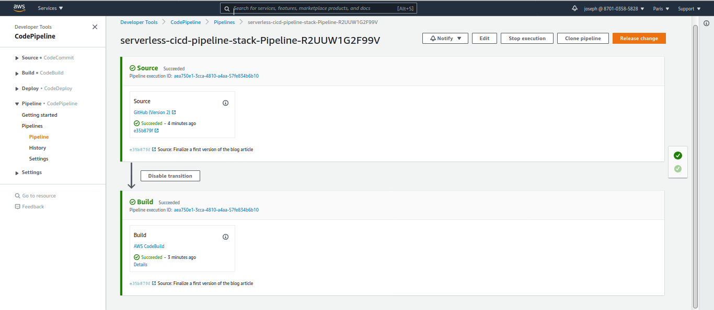

On est prêts à passer à la partie #2: code applicatif et intégration à la pipeline

###  <a name="references"></a> Références

- Repo original utilisé par l'auteur pour constituer la pipeline [https://github.com/mbimbij/aws-serverless-cicd-autonomie](https://github.com/mbimbij/aws-serverless-cicd-autonomie)
- Repo de support pour l'implémentation de la pipeline via `CloudFormation` [https://github.com/mbimbij/aws-serverless-cicd-demo](https://github.com/mbimbij/aws-serverless-cicd-demo)
- "archi de référence" pour une pipeline cicd serverless "simple": [https://github.com/aws-samples/aws-lambda-sample-applications/tree/master/CICD-toolchain-for-serverless-applications](https://github.com/aws-samples/aws-lambda-sample-applications/tree/master/CICD-toolchain-for-serverless-applications)
- archi de référence pour une pipeline cicd cross-account: [https://github.com/awslabs/aws-refarch-cross-account-pipeline](https://github.com/awslabs/aws-refarch-cross-account-pipeline)