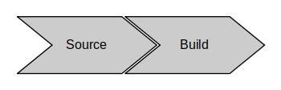
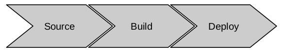
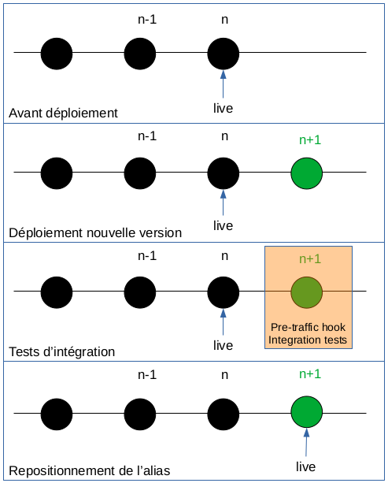
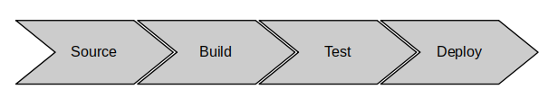

---
title: Implémentation d'une pipeline CI/CD pour des application AWS Serverless - partie 2
date: 12:30 03/25/2021
author: Joseph M'Bimbi-Bene
hero_classes: 'text-light overlay-dark-gradient'
hero_image: article-logo.png
taxonomy:
    category: blog
    tag: [devops, cloud, serverless]
---

Dans cette article, nous allons créer une fonction lambda en java, et l'intégrer à la pipeline de déploiement.

===

Voir aussi :

- [partie 1](https://joseph-mbimbi.fr/blog/serverless-cicd-demo-1)
- [partie 3](https://joseph-mbimbi.fr/blog/serverless-cicd-demo-3)

### Sommaire

- [Introduction](#introduction)
- [1. Implémentation de la fonction `Lambda` en java](#implementation-lambda-java)
- [2. Intégration de la fonction à la pipeline](#integration-application-pipeline)
- [3. Ajout d'une étape de déploiement simple](#deploiement-simple)
- [4. Ajout d'un test automatisés](#ajout-test-auto)
- [Conclusion et suite](#conclusion-et-suite)
- [Références](#references)

<small><i><a href='http://ecotrust-canada.github.io/markdown-toc/'>Table of contents generated with markdown-toc</a></i></small>


###  <a name="introduction"></a> Introduction

Cet article fait suite à la [partie 1][https://joseph-mbimbi.fr/blog/serverless-cicd-demo-1]. 

Le code est disponible à l'url suivante: [https://github.com/mbimbij/aws-serverless-cicd-demo](https://github.com/mbimbij/aws-serverless-cicd-demo)

Dans celui-ci, nous allons : 

- implémenter une fonction lambda très simple et l'intégrer à la pipeline de déploiement
- Implémenter des tests automatisés pour cette fonction

Ceci correspondant aux étapes 1.2 et 1.3 de l'implémentation de la pipeline.

Pour rappel, voici le résultat final que l'on souhaite obtenir:


Les étapes que l'on avait défini pour y arriver:


Et les sous-étapes de l'étape #1 :

- 1.1 - Implémentation des étapes "Source" + "Build" bouchonné
- 1.2 - Implémentation de l'application `Lambda` en Java
- 1.3 - Intégration du code application et de la pipeline
- 1.4 - (Bonus) Implémentation de tests automatisés pour la création de la pipeline

Cet article correspond donc à l'implémentation des étapes 1.2 et 1.3 .

###  <a name="implementation-lambda-java"></a> 1. Implémentation de la fonction `Lambda` en java


- Point de départ: tag `step1.1.6_codepipeline-project`
- Arrivée: tag `step1.2_add-java-lambda-function`

Nous créons un projet java dans le répertoire qui ne contenait précédemment que le template `CloudFormation`.

Nou ajoutons le handler `Lambda` suivant :

```java
@Slf4j
public class HelloHandler implements RequestHandler<Object,HelloResponse> {

  public final static String RESPONSE = "hello - v1";

  @Override
  public HelloResponse handleRequest(Object helloRequest, Context context) {
    log.info(RESPONSE);
    return new HelloResponse(RESPONSE);
  }
}
```

Comme vous pouvez le voir, il s'agit du code applicatif le plus minimal qui soit, le point central de cet article étant la pipeline de déploiement.

On aurait pu renvoyer une `Map`, ça aurait été encore plus simple, mais bon, le code avait deja été produit, les tags placés, donc on fait avec.

Nous allons utiliser `SAM` pour gérer le déploiement de cette lambda. `SAM` est une surcouche à `CloudFormation` pour gérer des applications serverless. 
Plus d'information disponible ici [https://docs.aws.amazon.com/serverless-application-model/latest/developerguide/what-is-sam.html](https://docs.aws.amazon.com/serverless-application-model/latest/developerguide/what-is-sam.html)

Voici le template que l'on utilisera:

```yaml
AWSTemplateFormatVersion: '2010-09-09'
Transform: 'AWS::Serverless-2016-10-31'
Description: AWS lambda for auto-formation purpose.
Resources:
  MainFunction:
    Type: AWS::Serverless::Function
    Properties:
      CodeUri: target/aws-serverless-cicd-demo-1.0-SNAPSHOT.jar
      Handler: com.example.HelloHandler
      Runtime: java11
      Description: Java function
      FunctionName: aws-serverless-cicd-demo
      MemorySize: 128
      Timeout: 30
      # Function's execution role
      Policies:
        - AWSLambdaBasicExecutionRole
        - AWSLambdaReadOnlyAccess
        - AWSXrayWriteOnlyAccess
        - AWSLambdaVPCAccessExecutionRole
      Tracing: Active
```

Description rapide: 

- `Transform`: indique qu'il s'agit d'un template `SAM`, et pas juste `CloudFormation`
- `Resources.MainFunction.CodeUri`: la fonction lambda doit être packagée en `.zip`, pour `NodeJS` ou `Python` typiquement, ou `.jar` pour java. Ici ce paramètre indique le chemin relatif vers le jar contenant le code de la lambda. ça doit être un "fat-jar", avec toutes les dépendances inclues
- `Resources.MainFunction.Handler`: le nom complet de la classe dans le jar contenant le handler
- `Resources.MainFunction.Runtime`: java11. Sont disponible aussi des runtimes `NodeJS`, `Python`, `Go`. On peut aussi créer un runtime custom si jamais on veut faire une fonction lambda pour un langage non supporté, tel que `C++` ou `Rust` par exemple
- `Resources.MainFunction.MemorySize`: Le nombre de MB alloué à la fonction. Détermine aussi la quantité de CPU allouée
- `Resources.MainFunction.Timeout`: Le timeout en secondes
- `Resources.MainFunction.Tracing`: On active le tracing `XRay`
- `Resources.MainFunction.Policies`: Les policies IAM attribuées à la fonction. On a repris ces rôles d'un précédent mini-projet, il semble y avoir plus de droits que nécessaire, mais tant pis

Nous allons déployer la fonction java via la CLI de SAM. SAM va uploader la fonction dans un bucket S3 et généré un nouveau template avec le `CodeUri` pointant vers l'emplacement S3. 

Pour cela on propose 2 manières de procéder: 

Tout d'abord, créez un bucket S3 ou récupérer le nom d'un bucket existant

Ensuite, on peut déployer en 3 commandes: 

```shell
mvn clean package
sam package --template-file sam-template.yml --s3-bucket $BUCKET --output-template-file out-sam-template.yml
sam deploy --template-file out-sam-template.yml --stack-name serverless-cicd-demo-application --no-confirm-changeset --capabilities CAPABILITY_IAM
```

Ou alors en 2 commandes: 

```shell
mvn clean package
sam deploy --template-file sam-template.yml --stack-name serverless-cicd-application-stack --capabilities CAPABILITY_IAM --no-confirm-changeset --s3-bucket $BUCKET
```

On peut aussi laisser SAM créer le bucket S3 tout seul:

```shell
mvn clean package
sam deploy --template-file sam-template.yml --stack-name serverless-cicd-application-stack --capabilities CAPABILITY_IAM --no-confirm-changeset --resolve-s3
```

###  <a name="integration-application-pipeline"></a> 2. Intégration de la fonction à la pipeline

- Point de départ: tag `step1.2_add-java-lambda-function`
- Arrivée: tag `step1.3.1_integrate-application-and-pipeline-build`

Au cours de cette étape nous effectuons:

- modification du `buildspec` dans la déclaration de la ressource `CodeBuild`, qui va lancer `sam package` et va placer le résultat dans le bucket S3
- rajout d'une variable d'environnement à `CodeBuild` pour y mettre le nom du bucket, afin qu'il soit accessible lors de l'éxécution du build
- rajout d'un cache à `CodeBuild` pour les dépendances maven 

mettez à jour la stack de la pipeline, pousser le code et vérifier que le bucket du pipeline est bien alimenté avec le résultat de `CodeBuild`

à la fin de cette étape, nous avons la pipeline suivante:



###  <a name="#deploiement-simple"></a> 3. Ajout d'une étape de déploiement simple

- Point de départ: tag `step1.3.1_integrate-application-and-pipeline-build`
- Arrivée: tag `step1.3.2_simplest-deploy`

Dans cette étape, nous allons déployer l'application. Pour cela, nous allons récupérer la sortie de l'étape de build, soit le template SAM en sortie de `sam package`.

Nous allons rajouter une étape de déploiement au projet `CodePipeline`, pour cela nous rajoutons à la stack `CloudFormation` de la pipeline:

- un paramètre pour le nom de la stack lié au déploiement du template `SAM` car `SAM` => `CloudFormation`
- un rôle `IAM` attribué au déploiement `CloudFormation` du template `SAM`
- une policy au rôle IAM du projet `CodePipeline` pour lui permettre de créer la stack `SAM`
- une policy au rôle IAM du projet `CodePipeline` pour lui permettre d'attribuer le rôle `CloudFormationRole` au déploiement `SAM`
- une étape de déploiement à `Codepipline`

à la fin de cette étape, nous avons la pipeline suivante:



###  <a name="ajout-test-auto"></a> 4. Ajout d'un test automatisés

- Point de départ: tag `step1.3.2_simplest-deploy`
- Arrivée: tag `step1.3.3_pre-traffic-hook-integration-test`

Dans cette étape, nous rajoutons un test automatisé permettant de vérifier la nouvelle version de la fonction `Lambda` déployée.

Void [https://github.com/aws/serverless-application-model/blob/master/docs/safe_lambda_deployments.rst](https://github.com/aws/serverless-application-model/blob/master/docs/safe_lambda_deployments.rst) en guise de référence.

Voici une illustration du processus:



Comme l'indique l'image, la pipeline va déployer une nouvelle version de la `Lambda`. Cependant, avant de rediriger le traffic vers cette version, nous avons configuré l'éxécution de tests automatisés. Si jamais les tests échouent, l'alias n'est pas repositionné sur la nouvelle version et le traffic n'est donc pas redirigé.

Pour réaliser cela nous avons effectué les ajouts et modifications suivantes:

- ajout d'un test automatisé en JUnit 
- introduction de modules séparés pour les différentes lambdas
  - un module pour la lambda de la fonction applicative
  - un module pour la lambda des tests automatisés
    - ayant une dépendance vers le module de la lambda principale. L'idée est d'avoir un test d'intégration pouvant être déclenché depuis le module principale, en Junit, par une lambda ou n'importe quel autre mécanisme. Appliquer le principe de l'archi héxa à l'éxécution de tests
- dans la stack de la pipeline, modification d'une policy codedeploy
- dans le template `SAM`: 
  - ajout d'une lambda éxécutant le test d'intégration.
  - ajout d'un "AutoPublishAlias" à la lambda de l'application pour effectuer automatiquement ce déplacement d'alias et publication de version
  - ajout d'un "PreTraffic" à la lambda de l'application pour l'éxécution des tests d'intégration avant la redirection du traffic

Les `Lambdas` de pre et post-traffic doivent avoir un nom en "CodeDeployHook_*", car pour les traffic hooks et les safe deployments, SAM va créer un projet `CodeDeploy` avec un rôle ayant la policy suivante:

```yaml
{
  "Action": [
      "lambda:InvokeFunction"
  ],
  "Resource": "arn:aws:lambda:*:*:function:CodeDeployHook_*",
  "Effect": "Allow"
}
```

Ce qui n'est pas clairement documenté, et que j'ai découvert via une issue github du projet `SAM`.

Récapitulons, à la fin de cette étape, nous avons la pipeline suivante:



###  <a name="conclusion-et-suite"></a> Conclusion et suite
Dans cet article, nous sommes parti d'un embryon de pipeline ayant juste les stages "Source" et "Build".

Nous avons:

- rajouté une fonction `Lambda` en java retournant en gros "hello-world"
- rajouté une étape à la pipeline pour déployer cette fonction 
- rajouté une étape pour tester le résultat renvoyé par la fonction avant de rediriger le traffic vers la nouvelle version déployée

Dans le prochain article, au choix nous allons:

- déployer la fonction dans un compte dédié au test et lancer les tests dedans, puis déployer dans un compte dédié à la prod ensuite
- créer une alarme se déclenchant en cas d'erreur lors de l'appel de la fonction, modifier le mode de déploiement en canary et rollback automatiquement en cas d'erreur

###  <a name="references"></a> Références

- Repo original utilisé par l'auteur pour constituer la pipeline [https://github.com/mbimbij/aws-serverless-cicd-autonomie](https://github.com/mbimbij/aws-serverless-cicd-autonomie)
- Repo de support pour l'implémentation de la pipeline via `CloudFormation` [https://github.com/mbimbij/aws-serverless-cicd-demo](https://github.com/mbimbij/aws-serverless-cicd-demo)
- "archi de référence" pour une pipeline cicd serverless "simple": [https://github.com/aws-samples/aws-lambda-sample-applications/tree/master/CICD-toolchain-for-serverless-applications](https://github.com/aws-samples/aws-lambda-sample-applications/tree/master/CICD-toolchain-for-serverless-applications)
- archi de référence pour une pipeline cicd cross-account: [https://github.com/awslabs/aws-refarch-cross-account-pipeline](https://github.com/awslabs/aws-refarch-cross-account-pipeline)
- Documentation sur les safe deployment lambda et les pre-traffic et post-traffic hooks [https://github.com/aws/serverless-application-model/blob/master/docs/safe_lambda_deployments.rst](https://github.com/aws/serverless-application-model/blob/master/docs/safe_lambda_deployments.rst)