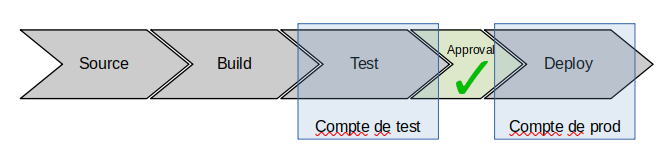

---
title: Implémentation d'une pipeline CI/CD pour des application AWS Serverless - partie 3
date: 12:30 03/31/2021
author: Joseph M'Bimbi-Bene
hero_classes: 'text-light overlay-dark-gradient'
hero_image: 'article-logo.png'
taxonomy:
    category: blog
    tag: [devops, cloud, serverless]
---

Dans cette article, nous allons créer une fonction lambda en java, et l'intégrer à la pipeline de déploiement.

===

Voir aussi :

- [partie 1](https://joseph-mbimbi.fr/blog/serverless-cicd-demo-1)
- [partie 2](https://joseph-mbimbi.fr/blog/serverless-cicd-demo-2)

### Sommaire

- [Introduction](#introduction)
- [1. Déploiement dans un compte de test](#deploiement-compte-test)
- [2. Déploiement dans un compte de prod](#deploiement-compte-prod)
- [Conclusion et suite](#conclusion-et-suite)
- [Références](#references)

<small><i><a href='http://ecotrust-canada.github.io/markdown-toc/'>Table of contents generated with markdown-toc</a></i></small>


###  <a name="introduction"></a> Introduction

Cet article fait suite à la [partie 2][https://joseph-mbimbi.fr/blog/serverless-cicd-demo-2]. 

Le code est disponible à l'url suivante: [https://github.com/mbimbij/aws-serverless-cicd-demo](https://github.com/mbimbij/aws-serverless-cicd-demo)

Dans celui-ci, nous allons : 

1. Faire déployer l'application dans un compte de test via la pipeline
2. Faire déployer l'application dans un compte de prod via la pipeline

Ceci correspondant aux étapes 2 et 3 de l'implémentation de la pipeline.

Pour rappel, voici le résultat final que l'on souhaite obtenir:



Les étapes que l'on avait défini pour y arriver:


###  <a name="deploiement-compte-test"></a> 1. Déploiement dans un compte de test

Nous allons découper cette étape en 2 sous-étapes:

- Intégration d'une clé KMS custom 
- Déploiement dans compte de test

Nous avons besoin d'introduire une clé KMS custom car `CodePipeline` utilise le "server side encryption" (SSE) pour stocker les artefacts dans le bucket S3 dédié.

Pour un déploiement cross-account, nous avons besoin d'introduire un rôle dans le compte cible, et ce rôle va récupérer les artefacts dans le bucket du compte d'origine.

Or, par défaut, `CodePipeline` utilise SSE-KMS avec une clé par défaut managée par AWS, dont on ne peut pas modifier la policy, ainsi le rôle du compte cible ne peut pas utiliser la clé et ne peut pas récupérer les artefacts et on se prendrait des http 403 "access denied" lors du déploiement. 

Nous avons donc besoin d'introduire une clé custom, avec une policy permettant au rôle du compte cible d'y accéder


####  <a name="deploiement-compte-test"></a> 1.1 Introduction d'une clé KMS custom

- Point de départ: tag `step1.3.3_pre-traffic-hook-integration-test`
- Arrivée: tag `step2.1_introduce-custom-kms-key`

On introduit une clé KMS dans le code `CloudFormation` de la pipeline.
On modifie aussi les projets `CodeBuild` et `CodePipeline` pour utiliser cette clé

```yaml
KmsKey:
  Type: AWS::KMS::Key
  Properties:
    Description: A KMS key to enable cross account deployments
    KeyPolicy:
      Version: '2012-10-17'
      Id: key-default-1
      Statement:
        - Sid: Enable IAM User Permissions
          Effect: Allow
          Principal:
            AWS: !Sub 'arn:aws:iam::${AWS::AccountId}:root'
          Action: kms:*
          Resource: '*'
        - Sid: Allow use of the key
          Effect: Allow
          Principal: '*'
          Action:
            - kms:DescribeKey
            - kms:Encrypt
            - kms:Decrypt
            - kms:ReEncrypt*
            - kms:GenerateDataKey
            - kms:GenerateDataKeyWithoutPlaintext
          Resource: '*'
BuildProject:
  [...]
  EncryptionKey: !GetAtt
    - KmsKey
    - Arn
Pipeline:
  [...]
  EncryptionKey:
    Id: !GetAtt
      - KmsKey
      - Arn
    Type: KMS
```

Lors de l'écriture de cette partie de l'article, nous nous sommes rendu compte que la policy de la clé est p-e un peu trop permissive.
On devrait limiter l'utilisation de la clé au user root et aux rôles de `CodeBuild` et `CodePipeline`.
Cela sera corrigé plus tard cependant

La pipeline est toujours fonctionnelle au passage

####  <a name="deploiement-compte-test"></a> 1.2 Déploiement cross-account

- Point de départ: tag `step2.1_introduce-custom-kms-key`
- Arrivée: tag `step2_deploy-test-account`

Beaucoup de changements dans cette étape:

1. Introduction d'un template `CloudFormation` pour la création des rôles IAM dédiés aux déploiements dans le compte de test
2. Déplacement des définitions du bucket S3 et de la clé KMS dans leur propre template. Cela pour pouvoir injecter l'arn de la clé KMS et le nom / arn du bucket S3 en paramètres des templates de la pipeline et des rôles du compte de test
   - On note que l'on a besoin que la clé KMS et le bucket S3 existe quand on y fait référence, par exemple dans les définitions de policies
3. un script shell pour orchestrer l'éxécution de la création des différentes stacks
4. un fichier `pipeline.env`, en gros un fichier de properties pour spécifier les profiles de la CLI AWS liés aux comptes de la pipeline et au compte de test

On notera au passage que l'on éxécute 2 fois le template `pre-requisites.yml`, une première fois pour créer la clé, une deuxième fois pour modifier la policy associée afin de permettre aux différents rôles d'accéder à la clé.

On ne peut rajouter ces policies uniquement une fois que les rôles sont deja créés, sinon on obtient une erreur du genre "policy contains invalid principals".
Un nouveau piège AWS, dommage on ne peut pas avoir de template `CloudFormation` qui déploient des ressources différentes dans différents compte.
Malheureusement les `StackSets` déploient les mêmes ressources dans des comptes différents, et ça ne correspond pas à notre cas d'utilisation


Pour créer la pipeline:

1. Créer un compte de test
2. Forker le repo [https://github.com/mbimbij/aws-serverless-cicd-demo](https://github.com/mbimbij/aws-serverless-cicd-demo)
3. remplir le fichier `pipeline.env` avec les bons profiles de la CLI AWS et le nom du repo que vous avez forké
4. éxécutez `create-pipeline.sh`
5. Activez la connexion Github (même avec `CloudFormation`, cela doit être fait manuellement "out of band")

###  <a name="deploiement-compte-prod"></a> 2. Déploiement dans un compte de prod

- Point de départ: tag `step2_deploy-test-account`
- Arrivée: tag `step3_deploy-test-and-prod-account`


Dans cette étape nous effectuons:

- Ajout d'une étape de validation manuelle après déploiement dans le compte de test
- déploiement dans le compte de prod
- déploiement "all at once" dans le compte de test et "canary" dans le compte de prod

À la fin de cette étape, nous avons la pipeline cible, et nous sommes particulièrement fier de nous !

Déploiement de la pipeline: 

0. Forker le repo [https://github.com/mbimbij/aws-serverless-cicd-demo](https://github.com/mbimbij/aws-serverless-cicd-demo)
1. Créer un compte pour l'environnement de test
2. Créer un compte pour l'environnement de prod
3. Créer un compte pour la pipeline
4. Définir les profiles suivants dans `~/.aws/config` et `~/.aws/credentials`
- profile `operations`: le profile du compte dédié à l'éxécution de la pipeline,
- profile `test`: le profile du compte faisant office d'environnement de test
- profile `prod`: le profile du compte faisant office d'environnement de prod
5. Vérifier que les profiles sont bien renseignés dans le fichier `pipeline.env`
6. Lancer la création de la pipeline: `./create-pipeline.sh`
7. Activez la connexion github dans compte d'opérations

###  <a name="conclusion-et-suite"></a> Conclusion et suite

Nous avons réalisé la pipeline cible suivante:


Les suites seraient:

- Ajouter une alarme et un rollback en cas d'erreur lors du déploiement canary en prod
- Refaire le code de la pipeline, mais avec `Terraform` cette fois-ci
- Faire une pipeline similaire, mais pour une appli basée sur `ElasticBeanstalk`, sur EKS ou sur des `EC2` gérés "manuellement"

Ce projet fut parfois assez frustrant, les messages d'erreurs ne sont pas toujours très explicites (http 403 access denied sur S3 typiquement), pas toujours faciles d'accès dans `CloudTrail`, parfois la documentation des produits AWS est bonne ... et parfois non.

Quoiqu'il en soit, on ressort de ce projet grandi, et j'espère que vous l'apprécierez comme je l'ai appr

###  <a name="references"></a> Références

- Repo original utilisé par l'auteur pour constituer la pipeline [https://github.com/mbimbij/aws-serverless-cicd-autonomie](https://github.com/mbimbij/aws-serverless-cicd-autonomie)
- Repo de support pour l'implémentation de la pipeline via `CloudFormation` [https://github.com/mbimbij/aws-serverless-cicd-demo](https://github.com/mbimbij/aws-serverless-cicd-demo)
- "archi de référence" pour une pipeline cicd serverless "simple": [https://github.com/aws-samples/aws-lambda-sample-applications/tree/master/CICD-toolchain-for-serverless-applications](https://github.com/aws-samples/aws-lambda-sample-applications/tree/master/CICD-toolchain-for-serverless-applications)
- archi de référence pour une pipeline cicd cross-account: [https://github.com/awslabs/aws-refarch-cross-account-pipeline](https://github.com/awslabs/aws-refarch-cross-account-pipeline)
- Documentation sur les safe deployment lambda et les pre-traffic et post-traffic hooks [https://github.com/aws/serverless-application-model/blob/master/docs/safe_lambda_deployments.rst](https://github.com/aws/serverless-application-model/blob/master/docs/safe_lambda_deployments.rst)